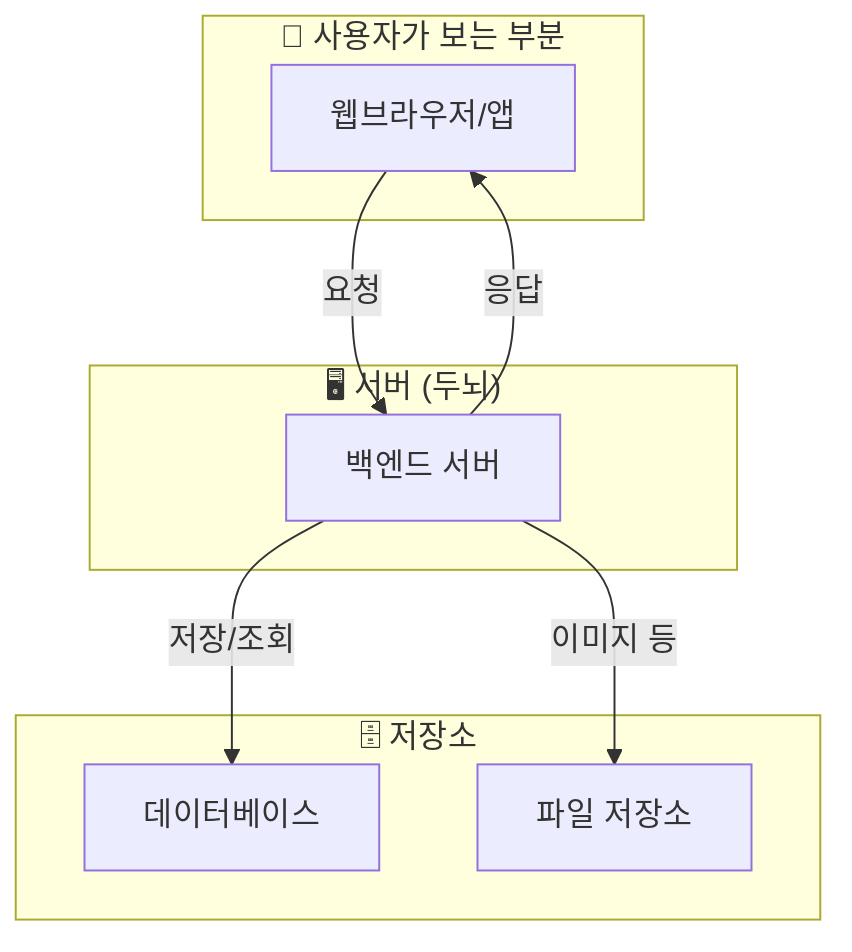
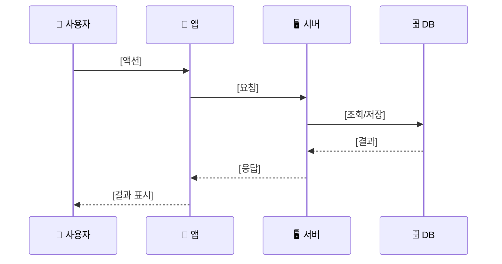
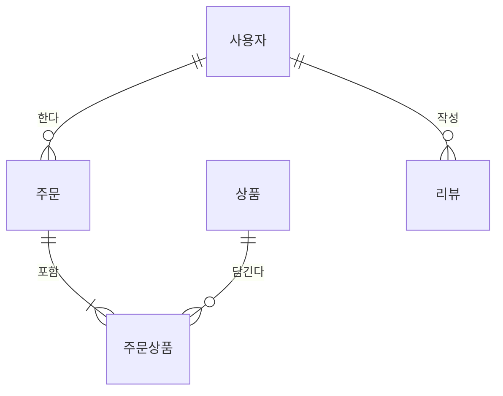

# Explain Docs - 비개발자를 위한 쉬운 기술 문서 생성 Instructions

<critical>The workflow execution engine is governed by: {project-root}/.anyon/core/tasks/workflow.xml</critical>
<critical>You MUST have already loaded and processed: {project-root}/.anyon/anyon-method/workflows/explain-docs/workflow.yaml</critical>
<critical>Communicate in {communication_language} throughout the workflow process</critical>

## 🎯 Workflow Goal

기술 문서(TRD, Architecture, ERD)를 **비개발자 창업자**가 쉽게 이해할 수 있는 버전으로 변환합니다.

**핵심 원칙:**
1. **스토리텔링** - 기술을 이야기로 풀어서 설명
2. **비유** - 일상적인 것에 빗대어 설명 (레스토랑, 도서관, 집 짓기 등)
3. **시각화** - Mermaid 다이어그램으로 복잡한 구조를 시각화
4. **Progressive Disclosure** - 한줄 요약 → 비유 → 상세 설명 순서
5. **용어 사전** - 기술 용어를 쉬운 말로 정리

---

<workflow>

<step n="0" goal="입력 문서 탐색 및 로드">

<action>planning 폴더에서 기술 문서들을 찾아 로드합니다:

1. **TRD 문서 찾기**: {output_folder}/planning/ 에서 *trd*.md 패턴으로 검색
2. **Architecture 문서 찾기**: {output_folder}/planning/ 에서 *architecture*.md 패턴으로 검색
3. **ERD 문서 찾기**: {output_folder}/planning/ 에서 *erd*.md 패턴으로 검색

각 문서를 완전히 읽어서 내용을 파악합니다.
</action>

<action>explain 폴더가 없으면 생성합니다: {explain_folder}</action>

<check if="어떤 문서도 찾을 수 없음">
  <action>사용자에게 알림: "planning 폴더에 기술 문서가 없습니다. 먼저 startup 워크플로우 체인을 실행해주세요."</action>
  <action>워크플로우 종료</action>
</check>

<action>찾은 문서 목록을 사용자에게 보여줍니다:
```
📄 발견된 문서:
- TRD: [파일명 또는 "없음"]
- Architecture: [파일명 또는 "없음"]
- ERD: [파일명 또는 "없음"]

이 문서들을 쉬운 버전으로 변환하겠습니다.
```
</action>

</step>

---

<step n="1" goal="TRD Easy 문서 생성" if="TRD 문서가 존재">

<action>TRD 문서를 분석하여 다음 구조로 쉬운 버전을 생성합니다:

## 문서 구조

```markdown
# 🛠️ 우리 서비스의 기술 스택 쉽게 이해하기

> **한줄 요약**: [서비스명]은 [주요 기술]로 만들어집니다.

## 📋 목차
1. 기술 스택이 뭔가요?
2. 우리가 선택한 기술들
3. 왜 이 기술을 선택했나요?
4. 비용은 얼마나 드나요?
5. 용어 사전

---

## 1. 기술 스택이 뭔가요?

[집 짓기 비유로 설명]
기술 스택은 집을 지을 때 필요한 재료와 도구를 정하는 것과 같습니다.
- **프론트엔드** = 집의 인테리어 (사용자가 보는 부분)
- **백엔드** = 집의 기초와 배관 (눈에 안 보이지만 중요)
- **데이터베이스** = 창고 (모든 정보를 보관)
- **호스팅** = 땅 (서비스가 돌아가는 공간)

---

## 2. 우리가 선택한 기술들

### 🎨 프론트엔드 (사용자가 보는 화면)

| 기술 | 쉬운 설명 | 왜 선택? |
|------|----------|---------|
| [기술명] | [비유로 설명] | [비즈니스 관점 이유] |

[Mermaid 다이어그램으로 구조 시각화]

### 🖥️ 백엔드 (서버)
[위와 동일한 형식]

### 🗄️ 데이터베이스
[위와 동일한 형식]

### ☁️ 호스팅/배포
[위와 동일한 형식]

---

## 3. 왜 이 기술을 선택했나요?

### 💰 비용 효율성
[무료 티어, 초기 비용 최소화 등]

### 🚀 성장 가능성
[확장성, 미래 대비]

### 👨‍💻 개발자 구하기
[해당 기술 개발자 풀]

---

## 4. 비용은 얼마나 드나요?

### MVP 단계 (0-1,000 사용자)
| 항목 | 월 비용 | 설명 |
|------|--------|------|
| 합계 | ₩X | |

### 성장 단계 (1,000-10,000 사용자)
[위와 동일]

---

## 5. 📚 용어 사전

| 기술 용어 | 쉬운 말로 |
|----------|----------|
| API | 프로그램끼리 대화하는 규칙 |
| 프레임워크 | 개발의 뼈대/설계도 |
| [추가 용어들] | [쉬운 설명] |
```
</action>

<action>Mermaid 다이어그램 예시를 포함합니다:


</action>

<action>생성된 문서를 {trd_easy_output}에 저장합니다.</action>

<template-output>trd_easy_content</template-output>

</step>

---

<step n="2" goal="Architecture Easy 문서 생성" if="Architecture 문서가 존재">

<action>Architecture 문서를 분석하여 다음 구조로 쉬운 버전을 생성합니다:

## 문서 구조

```markdown
# 🏗️ 우리 서비스 구조 쉽게 이해하기

> **한줄 요약**: [서비스명]은 [핵심 구조]로 작동합니다.

## 📋 목차
1. 시스템 구조가 뭔가요?
2. 전체 그림 보기
3. 데이터는 어떻게 흘러가나요?
4. 주요 기능별 작동 원리
5. 용어 사전

---

## 1. 시스템 구조가 뭔가요?

[레스토랑 비유로 설명]
시스템 구조는 레스토랑 운영과 비슷합니다:
- **프론트엔드** = 홀 (손님이 앉는 곳, 메뉴판)
- **백엔드** = 주방 (요리가 만들어지는 곳)
- **데이터베이스** = 냉장고/창고 (재료 보관)
- **API** = 주문서 (홀과 주방이 소통하는 방법)

---

## 2. 전체 그림 보기

[Mermaid 다이어그램으로 전체 구조 시각화]

### 🎯 핵심 구성요소

| 구성요소 | 역할 | 레스토랑 비유 |
|---------|------|-------------|
| [컴포넌트1] | [역할] | [비유] |

---

## 3. 데이터는 어떻게 흘러가나요?

### 예시: 사용자가 [주요 기능]을 할 때

[Mermaid 시퀀스 다이어그램]



**쉬운 설명:**
1. 사용자가 [액션]을 하면...
2. 앱이 서버에 "이거 해줘"라고 요청합니다
3. 서버가 데이터베이스에서 정보를 찾아서...
4. 사용자에게 결과를 보여줍니다

---

## 4. 주요 기능별 작동 원리

### 🔐 로그인/회원가입

**스토리:**
> 철수가 우리 서비스에 처음 가입할 때...
> 1. 이메일과 비밀번호를 입력합니다
> 2. 서버가 "이 이메일 처음 보는데?" 확인합니다
> 3. 비밀번호를 암호화해서 저장합니다 (원본은 우리도 몰라요!)
> 4. "출입증"(토큰)을 발급해서 다음부터 빠르게 인식합니다

### [다른 주요 기능들도 동일한 스토리텔링 형식으로]

---

## 5. 📚 용어 사전

| 기술 용어 | 쉬운 말로 |
|----------|----------|
| 캐싱 | 자주 쓰는 것 미리 준비해두기 |
| 로드밸런싱 | 일을 여러 서버에 나눠주기 |
| [추가 용어들] | [쉬운 설명] |
```
</action>

<action>생성된 문서를 {architecture_easy_output}에 저장합니다.</action>

<template-output>architecture_easy_content</template-output>

</step>

---

<step n="3" goal="ERD Easy 문서 생성" if="ERD 문서가 존재">

<action>ERD 문서를 분석하여 다음 구조로 쉬운 버전을 생성합니다:

## 문서 구조

```markdown
# 🗄️ 우리 데이터베이스 쉽게 이해하기

> **한줄 요약**: [서비스명]은 [N]개의 테이블로 모든 정보를 관리합니다.

## 📋 목차
1. 데이터베이스가 뭔가요?
2. 우리 서비스의 테이블들
3. 테이블 관계 이해하기
4. 실제 데이터 예시
5. 용어 사전

---

## 1. 데이터베이스가 뭔가요?

[엑셀 비유로 설명]
데이터베이스는 **초대형 엑셀 파일**이라고 생각하면 됩니다!
- **테이블** = 엑셀의 시트 한 장
- **컬럼(열)** = 엑셀의 A, B, C 열
- **로우(행)** = 엑셀의 1, 2, 3 행
- **관계** = 시트끼리 VLOOKUP으로 연결

---

## 2. 우리 서비스의 테이블들

### 📊 전체 테이블 목록

| 테이블 | 쉬운 이름 | 저장하는 정보 | 엑셀 비유 |
|--------|----------|--------------|----------|
| users | 회원 명부 | 이름, 이메일, 비밀번호 | 회원 명단 시트 |
| [테이블명] | [쉬운 이름] | [저장 정보] | [비유] |

### 👤 users 테이블 (회원 명부)

**엑셀로 보면 이런 모습:**

| id | 이메일 | 이름 | 가입일 |
|----|--------|------|--------|
| 1 | kim@email.com | 김철수 | 2024-01-15 |
| 2 | lee@email.com | 이영희 | 2024-01-16 |

**각 칸(컬럼)의 의미:**
- **id**: 회원 번호 (자동 부여)
- **이메일**: 로그인할 때 쓰는 아이디
- **이름**: 화면에 표시될 이름
- **가입일**: 언제 가입했는지

[각 테이블마다 동일한 형식으로]

---

## 3. 테이블 관계 이해하기

### 🔗 관계 다이어그램



### 관계 쉽게 이해하기

**1:N 관계 (한 명이 여러 개)**
> 한 사용자가 여러 주문을 할 수 있어요
> 마치 한 사람이 여러 번 식당에 올 수 있는 것처럼!

**N:M 관계 (여러 개 대 여러 개)**
> 한 주문에 여러 상품이 들어가고,
> 한 상품이 여러 주문에 포함될 수 있어요
> 마치 장바구니처럼!

---

## 4. 실제 데이터 예시

### 시나리오: 철수가 상품을 주문할 때

**Step 1: 철수 회원가입**
```
users 테이블에 추가:
| 1 | kim@email.com | 김철수 | 2024-01-15 |
```

**Step 2: 주문 생성**
```
orders 테이블에 추가:
| 101 | 1 (철수) | 50000원 | 배송중 | 2024-01-20 |
```

**Step 3: 주문 상품 연결**
```
order_items 테이블에 추가:
| 주문101 | 상품A | 2개 |
| 주문101 | 상품B | 1개 |
```

이렇게 여러 테이블이 연결되어 "철수가 뭘 샀는지" 알 수 있어요!

---

## 5. 📚 용어 사전

| 기술 용어 | 쉬운 말로 |
|----------|----------|
| Primary Key (PK) | 주민등록번호 같은 고유 번호 |
| Foreign Key (FK) | 다른 테이블 참조하는 번호 |
| Index | 책의 색인/목차 (빠른 검색용) |
| Constraint | 규칙 (예: 이메일 중복 불가) |
| [추가 용어들] | [쉬운 설명] |
```
</action>

<action>생성된 문서를 {erd_easy_output}에 저장합니다.</action>

<template-output>erd_easy_content</template-output>

</step>

---

<step n="4" goal="완료 메시지">

<action>생성된 문서들을 요약하여 사용자에게 보여줍니다:

```
✅ Easy Guide 문서 생성 완료!

📁 저장 위치: {explain_folder}/

생성된 파일:
├── trd-easy.md (기술 스택 쉬운 설명)
├── architecture-easy.md (시스템 구조 쉬운 설명)
└── erd-easy.md (데이터베이스 쉬운 설명)

📖 이 문서들의 특징:
- 비개발자도 이해할 수 있는 쉬운 언어
- 일상적인 비유로 기술 개념 설명
- Mermaid 다이어그램으로 시각화
- 각 문서 끝에 용어 사전 포함

💡 활용 방법:
- 투자자 미팅 전 기술 이해용
- 비개발 팀원과 공유
- 외주 개발사 커뮤니케이션 참고
```
</action>

</step>

</workflow>
