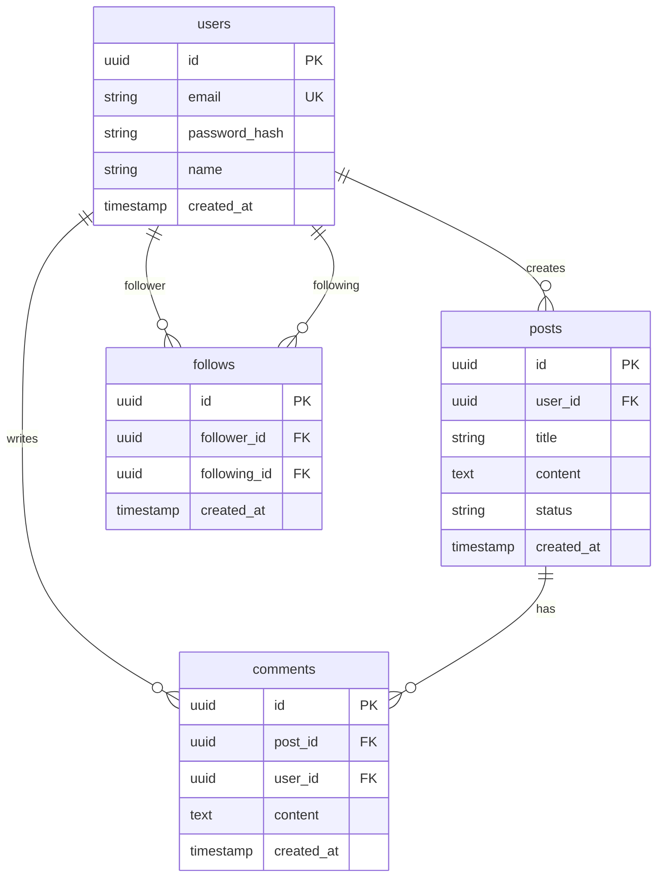

# Startup ERD Workflow Instructions

## 🎯 Workflow Goal

Create a comprehensive Entity Relationship Diagram (ERD) document that:
1. **For Non-Technical Founders**: Explains database structure using storytelling and analogies
2. **For AI/Developers**: Provides complete, implementation-ready database schema with all fields, types, relationships, indexes
3. **Leverages WebSearch**: Finds 4-8 ERD examples from similar services to learn best practices
4. **Consistency**: Aligns with all previous documents (PRD, UX, UI, TRD, Architecture)
5. **Final Step**: This is the last workflow in the chain - completes the entire documentation suite

<critical>💡 SKILL CHECK
작업을 수행할 때마다 사용 가능한 스킬 중 현재 상황에 적합한 스킬이 있는지 검토하고, 있으면 사용하세요.
</critical>

<critical>💡 SKILL RECOMMENDATION: postgresql-design
Use the `postgresql-design` skill throughout this workflow for:
- PostgreSQL-specific best practices
- Optimal data types for each field
- Indexing strategies (B-tree, GIN, GiST)
- Constraint patterns and validation
- Performance optimization patterns
- JSONB usage for flexible data

This skill provides comprehensive PostgreSQL schema design guidance.</critical>

<critical>QUESTION FORMAT RULE:
모든 질문은 반드시 객관식으로 제시하세요.
- 번호로 선택지를 제공 (1, 2, 3, 4...)
- 마지막 번호는 항상 "기타 (직접 입력)" 또는 주관식 옵션
- 예시:
  1. 옵션 A
  2. 옵션 B
  3. 옵션 C
  4. 기타 (직접 설명해주세요)
</critical>

---

## 📚 Step 0: Load All Previous Documents

<action>Read ALL five input documents to understand the complete context:

1. **Read PRD** (`{input_prd}`):
   - Extract: service_type, platform, core_features, target_users, success_metrics
   - Understand: What data needs to be stored for each feature

2. **Read UX Design** (`{input_ux}`):
   - Extract: all screens, user flows, data displayed/collected at each step
   - Understand: What data is shown to users, what data users create

3. **Read UI Design Guide** (`{input_ui}`):
   - Extract: any data-related components (forms, lists, tables)
   - Understand: Data presentation requirements

4. **Read TRD** (`{input_trd}`):
   - Extract: database system (PostgreSQL/MongoDB/etc), migration tool, ORM/schema tool
   - Understand: Database technology constraints

5. **Read Architecture** (`{input_architecture}`):
   - Extract: database architecture section, table previews, relationships preview
   - Understand: High-level data model structure already defined

<critical>
The ERD MUST use the exact database system from TRD.
The ERD MUST include tables for ALL features from PRD.
The ERD MUST support ALL user flows from UX Design.
The ERD MUST expand on the table previews from Architecture.
</critical>
</action>

---

## 🔍 Step 1: Analyze Data Requirements

<action>UX 목업과 PRD를 기반으로 데이터 요구사항을 분석합니다.

**분석 항목:**
1. **UX 목업 (핵심)** - 화면에 표시되는 데이터 → 필요한 테이블/컬럼
   - 목록 화면 → 어떤 데이터가 나열되는지
   - 상세 화면 → 어떤 필드들이 있는지
   - 입력 폼 → 사용자가 입력하는 데이터
   - 관계 → 화면 간 연결 (예: 목록 → 상세)
2. PRD의 핵심 기능에서 필요한 데이터 식별
3. Architecture의 API 엔드포인트에서 데이터 구조 파악

**AI 내장 지식 활용:**
- 일반적인 ERD 패턴 (정규화, 관계 설계)
- 서비스 유형별 표준 스키마 패턴
- PostgreSQL/Supabase 베스트 프랙티스

**서비스 유형별 표준 패턴 적용:**
| 서비스 유형 | 표준 테이블 패턴 |
|------------|-----------------|
| 소셜/커뮤니티 | users, posts, comments, likes, follows |
| 이커머스 | users, products, orders, order_items, reviews |
| SaaS/도구 | users, workspaces, projects, items |
| 예약/부킹 | users, resources, bookings, time_slots |
| 콘텐츠/미디어 | users, content, categories, tags, content_tags |

**Present analysis in {communication_language}:**

"{{project_name}}의 데이터 요구사항을 분석했어요.

**UX 목업에서 파악한 데이터:**
- [화면명]: [표시되는 데이터 목록]
- [입력 폼]: [사용자가 입력하는 필드들]

**PRD에서 파악한 핵심 데이터:**
- [데이터 1]: [어떤 기능에서 필요한지]
- [데이터 2]: [어떤 기능에서 필요한지]

**적용할 표준 패턴:**
- [패턴명]: [이유]

이제 스키마를 설계할게요."
</action>

---

## 🎯 Step 2: Define Database Design Principles

<action>Establish 3-5 database design principles for this project.

**Based on:**
- PRD features and data requirements
- TRD database choice (SQL vs NoSQL affects normalization)
- Architecture scalability strategy
- Project complexity and team size

**Common principles:**
1. **Normalization**: Reduce data redundancy (for SQL databases)
2. **Performance**: Design for fast reads (indexes on frequently queried fields)
3. **Scalability**: Support growth to [target users from PRD success_metrics]
4. **Data Integrity**: Enforce relationships and constraints
5. **Flexibility**: Allow for future feature additions
6. **Security**: Separate sensitive data, support encryption

**Explain in {communication_language} for non-technical founders:**

Example:
"**데이터베이스 설계 원칙:**

1. **정규화** (Normalization)
   - 같은 정보를 여러 곳에 중복 저장하지 않습니다
   - 예: 사용자 이름을 여러 테이블에 복사하지 않고, users 테이블에만 저장하고 ID로 참조
   - 왜? 사용자가 이름 변경하면 한 곳만 수정하면 됨

2. **성능 최적화**
   - 자주 검색하는 필드에 인덱스 생성
   - 예: 이메일로 사용자 찾기 → email 필드에 인덱스
   - 왜? 도서관 색인처럼 빠른 검색 가능

[Continue for all principles...]"
</action>

---

## 📋 Step 3: Identify All Required Tables

<action>Create a comprehensive list of all tables needed for the project.

**Sources for table identification:**

### From PRD Core Features
For each feature in PRD, identify required tables:
- User management → `users` table
- Authentication → `sessions` or `tokens` table
- Feature X → `feature_x` related tables

### From UX User Flows
Walk through each user flow and identify data:
- What data is created?
- What data is displayed?
- What data is updated/deleted?

### From Architecture Data Flows
Check architecture document's data flow section:
- What data entities are mentioned?
- What data is passed between components?

### Standard Tables (almost every app needs)
- `users` - User accounts
- `sessions` or `tokens` - Authentication
- Audit/logging tables (optional for MVP)

### Feature-Specific Tables
Based on PRD features:
- Posts/Content tables
- Comments/Interactions tables
- Relationships/Connections tables (followers, friends, etc.)
- Transactions/Orders tables (if e-commerce)
- Messages/Notifications tables (if messaging)
- Files/Media tables (if file uploads)
- etc.

**Create initial table list:**
```
Core Tables:
1. users
2. sessions (or auth_tokens)

Feature Tables:
3. [table_for_feature_1]
4. [table_for_feature_2]
5. [table_for_feature_3]
...

Junction Tables (for many-to-many relationships):
X. [junction_table_1]
...
```

**Explain to non-technical founders in {communication_language}:**

"**데이터베이스 테이블 목록:**

우리 서비스는 총 [N]개의 테이블이 필요합니다.

테이블은 엑셀 시트라고 생각하시면 됩니다. 각 테이블은:
- **users**: 회원 정보 저장 (이름, 이메일, 비밀번호 등)
- **posts**: 게시물 정보 저장 (제목, 내용, 작성일 등)
- **comments**: 댓글 정보 저장
...

[Continue with simple explanation for each table]"
</action>

---

## 🔧 Step 4: Design Each Table in Detail

<action>For EACH table identified in Step 3, design complete schema.

**For each table, define:**

### Table Template:

```markdown
### `table_name`

**Purpose**: [What this table stores in 1 sentence]

**비개발자 설명**: [Simple analogy in {communication_language}]

**Columns:**

| Column Name | Data Type | Constraints | Description |
|-------------|-----------|-------------|-------------|
| id | [INT/UUID] | PRIMARY KEY, AUTO_INCREMENT | Unique identifier |
| [column_2] | [TYPE(size)] | [NOT NULL / NULLABLE] | [Description] |
| created_at | TIMESTAMP | NOT NULL, DEFAULT NOW() | Record creation time |
| updated_at | TIMESTAMP | NOT NULL, DEFAULT NOW() | Last update time |

**Indexes:**
- PRIMARY KEY on `id`
- INDEX on `[frequently_queried_field]`
- UNIQUE INDEX on `[unique_field]` (e.g., email)

**Constraints:**
- FOREIGN KEY `[field]` REFERENCES `[other_table](id)` ON DELETE [CASCADE/SET NULL]
- CHECK `[field] > 0` (if applicable)
- UNIQUE `[field]` (if applicable)

**Sample Data:**
| id | [col2] | [col3] | created_at |
|----|--------|--------|------------|
| 1  | value1 | value2 | 2024-01-15 |
| 2  | value3 | value4 | 2024-01-16 |
```

---

### Critical Tables to Design:

#### 1. `users` Table (ALWAYS REQUIRED)

**Must include:**
- `id` (primary key)
- `email` (unique, indexed)
- `password_hash` (if custom auth) or external_id (if OAuth)
- `name` or `username`
- `created_at`, `updated_at`
- Any profile fields from PRD (avatar, bio, etc.)
- Role/permissions (if authorization needed)

**Example:**
```markdown
### `users`

**Purpose**: Stores user account information

**비개발자 설명**:
회원 정보를 저장하는 테이블입니다. 마치 회원 명부와 같습니다.

**Columns:**

| Column Name | Data Type | Constraints | Description |
|-------------|-----------|-------------|-------------|
| id | UUID | PRIMARY KEY | Unique user ID |
| email | VARCHAR(255) | NOT NULL, UNIQUE | User email address |
| password_hash | VARCHAR(255) | NOT NULL | Hashed password |
| name | VARCHAR(100) | NOT NULL | User full name |
| avatar_url | TEXT | NULLABLE | Profile picture URL |
| bio | TEXT | NULLABLE | User bio/description |
| role | VARCHAR(20) | NOT NULL, DEFAULT 'user' | User role (user/admin) |
| email_verified | BOOLEAN | NOT NULL, DEFAULT false | Email verification status |
| created_at | TIMESTAMP | NOT NULL, DEFAULT NOW() | Account creation time |
| updated_at | TIMESTAMP | NOT NULL, DEFAULT NOW() | Last update time |

**Indexes:**
- PRIMARY KEY on `id`
- UNIQUE INDEX on `email`
- INDEX on `role` (for admin queries)

**Constraints:**
- CHECK `role IN ('user', 'admin', 'moderator')`
- CHECK `email LIKE '%@%'` (basic email validation)

**Sample Data:**
| id | email | name | role | created_at |
|----|-------|------|------|------------|
| uuid-1 | john@example.com | John Doe | user | 2024-01-15 10:00:00 |
| uuid-2 | admin@example.com | Admin User | admin | 2024-01-15 10:00:00 |
```

#### 2. Authentication Table

Design based on TRD's auth solution:
- If JWT → `refresh_tokens` table (id, user_id, token_hash, expires_at)
- If sessions → `sessions` table (id, user_id, session_token, expires_at)
- If OAuth only → may not need separate table

#### 3. Feature Tables

For EACH core feature from PRD, design tables.

**Example for "Photo Sharing" feature:**

```markdown
### `photos`

**Purpose**: Stores uploaded photos and metadata

**비개발자 설명**:
사용자가 업로드한 사진 정보를 저장합니다. 사진 파일 자체는 S3에 저장되고, 여기엔 사진 정보(누가, 언제, 어디에 저장했는지)만 기록합니다.

**Columns:**

| Column Name | Data Type | Constraints | Description |
|-------------|-----------|-------------|-------------|
| id | UUID | PRIMARY KEY | Unique photo ID |
| user_id | UUID | NOT NULL, FOREIGN KEY | Photo owner |
| file_url | TEXT | NOT NULL | S3 URL of photo file |
| filename | VARCHAR(255) | NOT NULL | Original filename |
| file_size | INTEGER | NOT NULL | File size in bytes |
| width | INTEGER | NOT NULL | Image width in pixels |
| height | INTEGER | NOT NULL | Image height in pixels |
| caption | TEXT | NULLABLE | Photo caption/description |
| location | VARCHAR(255) | NULLABLE | Photo location |
| is_public | BOOLEAN | NOT NULL, DEFAULT true | Visibility setting |
| created_at | TIMESTAMP | NOT NULL, DEFAULT NOW() | Upload time |
| updated_at | TIMESTAMP | NOT NULL, DEFAULT NOW() | Last update time |

**Indexes:**
- PRIMARY KEY on `id`
- INDEX on `user_id` (to get user's photos)
- INDEX on `created_at DESC` (for chronological feeds)
- INDEX on `is_public` WHERE is_public = true (for public gallery)

**Constraints:**
- FOREIGN KEY `user_id` REFERENCES `users(id)` ON DELETE CASCADE
- CHECK `file_size > 0`
- CHECK `width > 0 AND height > 0`

**Sample Data:**
| id | user_id | filename | caption | created_at |
|----|---------|----------|---------|------------|
| uuid-1 | uuid-user1 | sunset.jpg | Beautiful sunset | 2024-01-15 18:30:00 |
| uuid-2 | uuid-user1 | cat.jpg | My cat | 2024-01-16 09:15:00 |
```

---

**Repeat this detailed design for ALL tables.**

**Coverage checklist:**
- [ ] Users and authentication
- [ ] All PRD core features
- [ ] All data shown in UX flows
- [ ] Comments/reactions (if social features)
- [ ] Notifications (if in PRD)
- [ ] Relationships/connections (followers, friends, etc. if applicable)
- [ ] Files/media metadata (if file uploads)
- [ ] Transactions/payments (if e-commerce)
- [ ] Any audit/logging tables (optional)

</action>

---

## 🔗 Step 5: Define All Table Relationships

<action>Map out all relationships between tables.

### Relationship Types:

**1. One-to-Many (가장 흔함)**
- One user has many posts
- One post has many comments
- Implementation: Foreign key in the "many" table

**2. Many-to-Many**
- Users follow many users (followers/following)
- Posts have many tags, tags have many posts
- Implementation: Junction table

**3. One-to-One (드물음)**
- User has one profile_settings
- Implementation: Foreign key with UNIQUE constraint

---

### Document Each Relationship:

```markdown
## Relationship 1: User → Photos (One-to-Many)

**Type**: One-to-Many
**Description**: Each user can upload many photos. Each photo belongs to one user.

**Implementation**:
- `photos.user_id` FOREIGN KEY REFERENCES `users.id`
- ON DELETE CASCADE (if user deleted, delete their photos)

**비개발자 설명**:
한 사용자가 여러 장의 사진을 올릴 수 있습니다. 각 사진은 한 명의 주인이 있습니다.
마치 사진첩에서 각 사진마다 "이건 철수 사진"이라고 표시해두는 것과 같습니다.

**Query Examples**:
- Get all photos by a user: `SELECT * FROM photos WHERE user_id = ?`
- Get photo owner: `SELECT u.* FROM users u JOIN photos p ON p.user_id = u.id WHERE p.id = ?`

---

## Relationship 2: User ↔ User (Many-to-Many) - Followers

**Type**: Many-to-Many
**Description**: Users can follow many users. Users can be followed by many users.

**Implementation**:
- Create junction table: `follows`

### `follows` (Junction Table)

| Column Name | Data Type | Constraints | Description |
|-------------|-----------|-------------|-------------|
| id | UUID | PRIMARY KEY | Unique follow relationship ID |
| follower_id | UUID | NOT NULL, FOREIGN KEY | User who follows |
| following_id | UUID | NOT NULL, FOREIGN KEY | User being followed |
| created_at | TIMESTAMP | NOT NULL, DEFAULT NOW() | When follow happened |

**Indexes:**
- PRIMARY KEY on `id`
- UNIQUE INDEX on `(follower_id, following_id)` - prevent duplicate follows
- INDEX on `follower_id` - to get "who I follow"
- INDEX on `following_id` - to get "my followers"

**Constraints:**
- FOREIGN KEY `follower_id` REFERENCES `users(id)` ON DELETE CASCADE
- FOREIGN KEY `following_id` REFERENCES `users(id)` ON DELETE CASCADE
- CHECK `follower_id != following_id` - can't follow yourself

**비개발자 설명**:
팔로우 관계를 저장하는 테이블입니다.
예: 철수가 영희를 팔로우하면 → (follower=철수, following=영희) 한 줄 추가
영희가 철수를 팔로우하면 → (follower=영희, following=철수) 또 한 줄 추가

**Query Examples**:
- Get users I follow: `SELECT u.* FROM users u JOIN follows f ON f.following_id = u.id WHERE f.follower_id = ?`
- Get my followers: `SELECT u.* FROM users u JOIN follows f ON f.follower_id = u.id WHERE f.following_id = ?`
- Check if A follows B: `SELECT * FROM follows WHERE follower_id = ? AND following_id = ?`
```

---

**Create relationship documentation for ALL relationships in the database.**

**Common relationships to cover:**
- User → [Feature entities] (posts, photos, etc.)
- User → Comments/Reactions
- User ↔ User (follows, friends, blocks)
- Posts → Comments
- Posts ↔ Tags (if tagging feature)
- User → Notifications
- User → Sessions/Tokens
- etc.

</action>

---

## 🔑 Step 6: Define Indexing Strategy

<action>For each table, identify which fields need indexes.

### When to Index:

**PRIMARY KEYS**: Always indexed automatically

**FOREIGN KEYS**: Almost always should be indexed
- Reason: Frequent JOINs on these fields

**UNIQUE FIELDS**: Indexed automatically with UNIQUE constraint
- email, username, etc.

**Frequently Queried Fields**:
- Fields used in WHERE clauses
- Fields used in ORDER BY
- Fields used in JOIN conditions

**From UX Flows - identify query patterns:**
- "Show posts by user" → index `posts.user_id`
- "Show recent posts" → index `posts.created_at DESC`
- "Search posts by title" → index `posts.title` or full-text index
- "Filter by category" → index `posts.category_id`

---

### Index Documentation Template:

```markdown
## Indexing Strategy

### Table: `posts`

**Indexes:**

1. **PRIMARY KEY** on `id`
   - Auto-created
   - Purpose: Unique identifier, fastest lookup

2. **INDEX** on `user_id`
   - Purpose: Get all posts by a user (common query from UX)
   - Query: `SELECT * FROM posts WHERE user_id = ?`
   - Impact: Speeds up user profile page

3. **INDEX** on `created_at DESC`
   - Purpose: Show recent posts (feed page)
   - Query: `SELECT * FROM posts ORDER BY created_at DESC LIMIT 20`
   - Impact: Fast feed loading

4. **COMPOSITE INDEX** on `(is_published, created_at DESC)`
   - Purpose: Show only published posts, ordered by date
   - Query: `SELECT * FROM posts WHERE is_published = true ORDER BY created_at DESC`
   - Impact: Optimizes public feed

5. **FULL-TEXT INDEX** on `(title, content)` (if database supports)
   - Purpose: Search functionality
   - Query: `SELECT * FROM posts WHERE MATCH(title, content) AGAINST(?)`
   - Impact: Fast text search

**비개발자 설명**:
인덱스는 책의 색인(index)과 같습니다.
- 색인 없이: 책 전체를 한 장씩 넘기며 찾기 (느림)
- 색인 있으면: 색인에서 페이지 번호 찾아 바로 가기 (빠름)

우리는 자주 찾는 필드들에 인덱스를 만들어서 검색 속도를 높입니다.
```

**Create index documentation for all major tables.**

**Trade-offs to explain:**
- ✅ Pros: Faster reads
- ⚠️ Cons: Slower writes (insert/update), more storage
- 💡 Strategy: Index only frequently queried fields

</action>

---

## 🔒 Step 7: Define Constraints and Validations

<action>Document all database-level constraints.

### Constraint Types:

**1. PRIMARY KEY** - Unique identifier (all tables)

**2. FOREIGN KEY** - Enforce relationships
```sql
FOREIGN KEY (user_id) REFERENCES users(id) ON DELETE CASCADE
```

**ON DELETE options:**
- CASCADE: Delete child records when parent deleted
- SET NULL: Set foreign key to NULL
- RESTRICT: Prevent deletion if children exist
- NO ACTION: Same as RESTRICT

**3. UNIQUE** - Ensure uniqueness
```sql
UNIQUE (email)
UNIQUE (username)
UNIQUE (follower_id, following_id) -- composite unique
```

**4. NOT NULL** - Require value
```sql
email VARCHAR(255) NOT NULL
```

**5. CHECK** - Custom validation
```sql
CHECK (age >= 18)
CHECK (price > 0)
CHECK (status IN ('draft', 'published', 'archived'))
CHECK (email LIKE '%@%')
```

**6. DEFAULT** - Default value
```sql
created_at TIMESTAMP NOT NULL DEFAULT NOW()
is_active BOOLEAN NOT NULL DEFAULT true
```

---

### Document Constraints:

```markdown
## Constraints Summary

### `users` Table Constraints
- PRIMARY KEY on `id`
- UNIQUE on `email`
- CHECK `email LIKE '%@%'` (basic email format)
- CHECK `role IN ('user', 'admin', 'moderator')`
- NOT NULL on `email`, `password_hash`, `name`
- DEFAULT NOW() on `created_at`, `updated_at`

### `posts` Table Constraints
- PRIMARY KEY on `id`
- FOREIGN KEY `user_id` REFERENCES `users(id)` ON DELETE CASCADE
  - Reason: If user deleted, delete their posts
- CHECK `status IN ('draft', 'published', 'archived')`
- NOT NULL on `user_id`, `title`, `content`

### `follows` Table Constraints
- PRIMARY KEY on `id`
- UNIQUE on `(follower_id, following_id)` - prevent duplicate follows
- FOREIGN KEY `follower_id` REFERENCES `users(id)` ON DELETE CASCADE
- FOREIGN KEY `following_id` REFERENCES `users(id)` ON DELETE CASCADE
- CHECK `follower_id != following_id` - can't follow yourself

[Continue for all tables...]

**비개발자 설명**:
제약조건(Constraints)은 데이터베이스의 규칙입니다.

예를 들어:
- **UNIQUE**: 이메일은 중복 불가 (한 이메일 = 한 계정)
- **NOT NULL**: 이름은 필수 (빈칸 불가)
- **CHECK**: 나이는 18세 이상만 가능
- **FOREIGN KEY**: 게시물 작성자는 반드시 users 테이블에 존재해야 함

이런 규칙들이 데이터의 정확성을 보장합니다.
```
</action>

---

## 📊 Step 8: Define Data Types and Sizes

<action>For each field, choose appropriate data type based on TRD's database.

### Common Data Types (adjust based on TRD database):

**PostgreSQL / MySQL:**
- `UUID` or `SERIAL/AUTO_INCREMENT` for IDs
- `VARCHAR(n)` for short text with max length
- `TEXT` for long text
- `INTEGER` / `BIGINT` for numbers
- `DECIMAL(p,s)` for money/precise decimals
- `BOOLEAN` for true/false
- `TIMESTAMP` or `DATETIME` for dates/times
- `JSON` or `JSONB` for flexible data

**MongoDB / NoSQL:**
- `ObjectId` for IDs
- `String` for text
- `Number` for integers/floats
- `Boolean`
- `Date`
- `Array` for lists
- `Object` for nested data

---

### Data Type Decisions Document:

```markdown
## Data Type Specifications

### ID Fields
- **Type**: UUID (PostgreSQL) or ObjectId (MongoDB)
- **Reason**: Globally unique, non-sequential (security), distributed-friendly
- **Alternative**: SERIAL/AUTO_INCREMENT (simpler but less secure)
- **우리 선택**: UUID

### Email Fields
- **Type**: VARCHAR(255)
- **Reason**: Email max length is 254 characters (RFC 5321)
- **Index**: Yes, UNIQUE
- **Validation**: CHECK constraint or application-level

### Password Fields
- **Type**: VARCHAR(255) or TEXT
- **Reason**: Store bcrypt/argon2 hash (60-100 characters typically)
- **Note**: NEVER store plain passwords

### Name/Username Fields
- **Type**: VARCHAR(100) for names, VARCHAR(30) for usernames
- **Reason**: Reasonable max length, saves space vs TEXT
- **Index**: Username should be UNIQUE indexed

### Content/Body Fields
- **Type**: TEXT
- **Reason**: No max length limit, flexible for long content
- **Note**: Use VARCHAR only if strict limit needed

### Money/Price Fields
- **Type**: DECIMAL(10, 2) or INTEGER (cents)
- **Reason**: DECIMAL for exact precision, INTEGER if storing cents
- **Example**: $99.99 → DECIMAL: 99.99, INTEGER: 9999 (cents)
- **우리 선택**: DECIMAL(10,2) - stores up to $99,999,999.99

### Boolean Flags
- **Type**: BOOLEAN
- **Examples**: is_active, is_published, email_verified
- **Default**: Usually false or true depending on field

### Timestamps
- **Type**: TIMESTAMP WITH TIME ZONE (PostgreSQL) or DATETIME (MySQL)
- **Fields**: created_at, updated_at, deleted_at (soft deletes)
- **Default**: NOW() / CURRENT_TIMESTAMP
- **Index**: Yes for created_at (for ordering)

### File URLs
- **Type**: TEXT
- **Reason**: S3/CDN URLs can be long
- **Example**: https://mybucket.s3.amazonaws.com/uploads/...

### File Sizes
- **Type**: BIGINT (bytes)
- **Reason**: Large files can exceed INTEGER max (2GB)
- **Display**: Convert to KB/MB/GB in application

### Enums/Status Fields
- **Type**: VARCHAR(20) or ENUM (if database supports)
- **Examples**: status ('draft', 'published'), role ('user', 'admin')
- **Constraint**: CHECK IN (...) for validation
- **Index**: Maybe, if frequently filtered

### JSON Fields (for flexible data)
- **Type**: JSONB (PostgreSQL) or JSON (MySQL) or Object (MongoDB)
- **Use cases**: User settings, metadata, tags
- **Index**: GIN index for JSONB queries (PostgreSQL)
- **Example**: `{"theme": "dark", "notifications": true}`

**비개발자 설명**:
데이터 타입은 각 칸에 어떤 종류의 정보를 넣을지 정하는 것입니다.

엑셀과 비교하면:
- **VARCHAR(255)** = 텍스트 칸 (최대 255글자)
- **INTEGER** = 숫자 칸 (정수만)
- **DECIMAL** = 숫자 칸 (소수점 가능)
- **BOOLEAN** = 체크박스 (예/아니오)
- **TIMESTAMP** = 날짜/시간 칸
- **TEXT** = 긴 글 칸 (길이 제한 없음)

적절한 타입을 선택하면 저장공간도 절약되고 속도도 빨라집니다.
```
</action>

---

## 🔄 Step 9: Define Migration Strategy

<action>Based on TRD's migration tool, define how to create and manage schema.

### Migration Strategy Document:

```markdown
## Database Migration Strategy

### Migration Tool
- **Tool**: [from TRD - e.g., Prisma Migrate, TypeORM migrations, Sequelize, Rails migrations, etc.]
- **Language**: [SQL / ORM DSL]

### Migration Files Structure

**Initial Migration** (create all tables):
```
migrations/
  001_create_users.sql
  002_create_sessions.sql
  003_create_posts.sql
  004_create_comments.sql
  005_create_follows.sql
  ...
```

**Or single file** (depending on tool):
```
migrations/
  20240115_initial_schema.sql
```

### Sample Migration (create users table):

**Using Raw SQL**:
```sql
-- migrations/001_create_users.sql
CREATE TABLE users (
  id UUID PRIMARY KEY DEFAULT gen_random_uuid(),
  email VARCHAR(255) NOT NULL UNIQUE,
  password_hash VARCHAR(255) NOT NULL,
  name VARCHAR(100) NOT NULL,
  avatar_url TEXT,
  bio TEXT,
  role VARCHAR(20) NOT NULL DEFAULT 'user',
  email_verified BOOLEAN NOT NULL DEFAULT false,
  created_at TIMESTAMP NOT NULL DEFAULT NOW(),
  updated_at TIMESTAMP NOT NULL DEFAULT NOW(),

  CONSTRAINT users_email_format CHECK (email LIKE '%@%'),
  CONSTRAINT users_role_check CHECK (role IN ('user', 'admin', 'moderator'))
);

CREATE INDEX idx_users_email ON users(email);
CREATE INDEX idx_users_role ON users(role);
```

**Using Prisma** (if TRD uses Prisma):
```prisma
// prisma/schema.prisma
model User {
  id            String   @id @default(uuid())
  email         String   @unique
  passwordHash  String
  name          String
  avatarUrl     String?
  bio           String?
  role          Role     @default(USER)
  emailVerified Boolean  @default(false)
  createdAt     DateTime @default(now())
  updatedAt     DateTime @updatedAt

  posts         Post[]
  comments      Comment[]

  @@index([role])
}

enum Role {
  USER
  ADMIN
  MODERATOR
}
```

### Migration Execution

**Development**:
```bash
# Create migration
[command from TRD - e.g., `prisma migrate dev`, `npm run migrate:create`]

# Run migrations
[command from TRD - e.g., `prisma migrate deploy`, `npm run migrate`]

# Rollback (if supported)
[command from TRD]
```

**Production**:
```bash
# Run migrations as part of deployment
# Usually in CI/CD pipeline before app starts
[command from TRD]
```

### Migration Best Practices

1. **Never edit existing migrations** - always create new ones
2. **Always test migrations on staging first**
3. **Backup database before production migrations**
4. **Make migrations reversible** (if possible)
5. **Keep migrations small and focused**

### Seeding Strategy

**Seed Data Files** (for development):
```
seeds/
  001_seed_users.sql     # Create test users
  002_seed_posts.sql     # Create test posts
  003_seed_follows.sql   # Create test relationships
```

**When to seed**:
- Local development: Always
- Staging: Maybe (for testing)
- Production: Never (except initial admin user)

**비개발자 설명**:
Migration은 데이터베이스 버전 관리입니다.

마치 건물 공사처럼:
- **Migration 1**: 기초 공사 (users 테이블 생성)
- **Migration 2**: 1층 건설 (posts 테이블 추가)
- **Migration 3**: 2층 건설 (comments 테이블 추가)

각 단계가 파일로 기록되어서:
- 새 개발자가 합류하면 → 모든 migration 실행해서 동일한 DB 구조 생성
- 프로덕션 배포할 때 → migration 실행해서 DB 업데이트
- 문제 생기면 → 이전 migration으로 롤백 가능 (선택적)
```
</action>

---

## 💾 Step 10: Create Sample Data

<action>For each major table, provide realistic sample data.

### Purpose:
- Help developers understand data structure
- Provide seed data for development
- Show realistic examples for non-technical stakeholders

### Sample Data Template:

```markdown
## Sample Data Examples

### `users` Sample Data

| id | email | name | role | avatar_url | created_at |
|----|-------|------|------|------------|------------|
| uuid-001 | john@example.com | John Doe | user | https://i.pravatar.cc/150?img=1 | 2024-01-15 10:00:00 |
| uuid-002 | jane@example.com | Jane Smith | user | https://i.pravatar.cc/150?img=2 | 2024-01-15 10:05:00 |
| uuid-003 | admin@example.com | Admin User | admin | https://i.pravatar.cc/150?img=3 | 2024-01-15 09:00:00 |

### `posts` Sample Data

| id | user_id | title | content | status | created_at |
|----|---------|-------|---------|--------|------------|
| uuid-101 | uuid-001 | My First Post | Hello world! This is my first post. | published | 2024-01-15 14:30:00 |
| uuid-102 | uuid-001 | Draft Post | Work in progress... | draft | 2024-01-15 15:00:00 |
| uuid-103 | uuid-002 | Welcome Everyone | Happy to be here! | published | 2024-01-15 16:00:00 |

### `comments` Sample Data

| id | post_id | user_id | content | created_at |
|----|---------|---------|---------|------------|
| uuid-201 | uuid-101 | uuid-002 | Great first post! | 2024-01-15 14:35:00 |
| uuid-202 | uuid-101 | uuid-003 | Welcome! | 2024-01-15 14:40:00 |
| uuid-203 | uuid-103 | uuid-001 | Thanks for joining! | 2024-01-15 16:05:00 |

### `follows` Sample Data

| id | follower_id | following_id | created_at |
|----|-------------|--------------|------------|
| uuid-301 | uuid-001 | uuid-002 | 2024-01-15 11:00:00 |
| uuid-302 | uuid-002 | uuid-001 | 2024-01-15 11:30:00 |
| uuid-303 | uuid-003 | uuid-001 | 2024-01-15 12:00:00 |

**이 데이터로 할 수 있는 쿼리 예시**:
- John의 모든 게시물: `SELECT * FROM posts WHERE user_id = 'uuid-001'`
- 첫 번째 게시물의 모든 댓글: `SELECT * FROM comments WHERE post_id = 'uuid-101'`
- John의 팔로워: `SELECT u.* FROM users u JOIN follows f ON f.follower_id = u.id WHERE f.following_id = 'uuid-001'`
```

**Create sample data for ALL major tables.**
</action>

---

## 📊 Step 11: Estimate Data Volume

<action>Based on PRD success_metrics, estimate database growth.

```markdown
## Estimated Data Volume

### Success Metrics from PRD
- Target users (Year 1): [from PRD - e.g., 10,000 users]
- Target users (Year 3): [from PRD - e.g., 100,000 users]
- Daily active users: [estimate - e.g., 30% of total]

### Storage Estimates

#### `users` Table
- **Row size**: ~500 bytes (with avatar URLs, bio)
- **Year 1**: 10,000 users × 500 bytes = 5 MB
- **Year 3**: 100,000 users × 500 bytes = 50 MB
- **Growth rate**: Steady growth

#### `posts` Table
- **Row size**: ~2 KB (average with content)
- **Posts per user**: 10 posts (estimate)
- **Year 1**: 10,000 users × 10 posts × 2 KB = 200 MB
- **Year 3**: 100,000 users × 10 posts × 2 KB = 2 GB
- **Growth rate**: High growth (content platform)

#### `comments` Table
- **Row size**: ~500 bytes
- **Comments per post**: 5 comments (estimate)
- **Year 1**: 100,000 posts × 5 comments × 500 bytes = 250 MB
- **Year 3**: 1,000,000 posts × 5 comments × 500 bytes = 2.5 GB

#### `photos` (if applicable)
- **Metadata only** (files in S3): ~300 bytes per row
- **Photos per user**: 20 photos
- **Year 1**: 10,000 users × 20 × 300 bytes = 60 MB
- **Year 3**: 100,000 users × 20 × 300 bytes = 600 MB

#### Total Database Size Estimate
- **Year 1**: ~500 MB - 1 GB
- **Year 3**: ~5 GB - 10 GB
- **Well within** [database plan from TRD] limits

### File Storage (S3/CDN)
- **Average photo size**: 2 MB
- **Year 1**: 10,000 users × 20 photos × 2 MB = 400 GB
- **Year 3**: 100,000 users × 20 photos × 2 MB = 4 TB
- **Cost**: [reference TRD storage costs]

**비개발자 설명**:
우리 데이터베이스는 이렇게 성장할 것으로 예상됩니다:

**1년 후**: 약 500MB - 1GB
- 이건 고화질 영화 1편 정도 크기입니다
- 무료 데이터베이스로 충분합니다

**3년 후**: 약 5-10GB
- 고화질 영화 5편 정도
- 여전히 저렴한 플랜으로 가능 (월 [X]만원)

**사진 파일들** (별도 저장):
- 1년: 400GB, 3년: 4TB
- S3 저장 비용: [from TRD cost]

이 예측은 PRD의 목표 사용자 수 기반입니다.
```
</action>

---

## 🚀 Step 12: Scalability Considerations

<action>Document database scalability strategies.

```markdown
## Database Scalability Strategy

### Phase 1: MVP (0-10,000 users)
**Current Setup**:
- Single database instance
- All tables in one database
- Basic indexes

**Performance**:
- Expected: Excellent (< 100ms queries)
- No optimization needed yet

**Cost**: [from TRD - usually FREE tier]

---

### Phase 2: Growth (10,000-100,000 users)
**Potential Issues**:
- Slower queries on large tables
- Increased read load

**Solutions**:

1. **Query Optimization**
   - Review slow query logs
   - Add composite indexes
   - Optimize N+1 queries

2. **Read Replicas** (if needed)
   - Route read traffic to replicas
   - Keep writes on primary
   - Cost: [from TRD]

3. **Caching** (if in TRD)
   - Cache frequent queries in Redis
   - Cache user sessions
   - Reduce database load

4. **Archive Old Data**
   - Move old posts/logs to archive tables
   - Keep active data small

**Cost**: [from TRD Growth phase]

---

### Phase 3: Scale (100,000+ users)
**Potential Issues**:
- Very large tables (>100M rows)
- High write throughput
- Geographic distribution

**Solutions**:

1. **Horizontal Partitioning (Sharding)**
   - Shard by user_id or geographic region
   - Example: Users 0-50K in DB1, 50K-100K in DB2
   - Complex but scales infinitely

2. **Vertical Partitioning**
   - Split hot tables to separate databases
   - Example: sessions DB, analytics DB, main DB

3. **Database Clustering**
   - Multi-master setup
   - Automatic failover
   - High availability

4. **NoSQL for Specific Use Cases**
   - Keep main data in SQL
   - Move logs/analytics to NoSQL
   - Use right tool for each job

**Cost**: [from TRD Scale phase]

---

### Indexing for Scale

**Current Indexes** (from Step 6): [list all indexes]

**Future Indexes** (add when needed):
- Partial indexes for common filters
- Covering indexes for frequent queries
- Full-text search indexes (if search feature grows)

**Index Monitoring**:
- Track index usage
- Remove unused indexes
- Update statistics regularly

---

**비개발자 설명**:

데이터베이스 확장은 식당 확장과 비슷합니다:

**Phase 1 (작은 식당)**:
- 한 주방, 한 셰프
- 30명 손님 OK
- 문제 없음

**Phase 2 (중형 레스토랑)**:
- 주방은 하나, 셰프 2명 (read replica)
- 100명 손님 OK
- 인기 메뉴는 미리 준비 (caching)

**Phase 3 (대형 체인)**:
- 여러 지점 (sharding)
- 각 지점이 독립적으로 운영
- 500명+ 손님 OK

우리는 Phase 1로 시작하고, 필요할 때 확장합니다.
```
</action>

---

## 🔐 Step 13: Data Security Considerations

<action>Document security measures at database level.

```markdown
## Database Security

### 1. Sensitive Data Handling

**Password Storage**:
- ❌ NEVER store plain passwords
- ✅ Store hashed passwords (bcrypt, argon2)
- Field: `password_hash` VARCHAR(255)
- Hashing: Done in application before saving

**Personal Identifiable Information (PII)**:
- Email, name, phone, address
- **Encryption at rest**: [enabled/not enabled in TRD hosting]
- **Encryption in transit**: HTTPS/TLS for all connections
- **Access control**: Limit who can query PII

**Payment Information**:
- ❌ NEVER store credit card numbers
- ✅ Use payment provider tokens (Stripe, PayPal)
- Store: customer_id, last4, payment_method_id (tokens only)

### 2. Access Control

**Database Users**:
- **Application user**: Limited permissions (SELECT, INSERT, UPDATE, DELETE on specific tables)
- **Admin user**: Full permissions (for migrations only)
- **Read-only user**: SELECT only (for analytics, reporting)

**Example PostgreSQL permissions**:
```sql
-- Application user
CREATE USER app_user WITH PASSWORD 'secure_password';
GRANT SELECT, INSERT, UPDATE, DELETE ON ALL TABLES IN SCHEMA public TO app_user;

-- Analytics read-only user
CREATE USER analytics_user WITH PASSWORD 'secure_password';
GRANT SELECT ON ALL TABLES IN SCHEMA public TO analytics_user;
```

### 3. SQL Injection Prevention

- ✅ Use parameterized queries (ALWAYS)
- ✅ Use ORM query builders
- ❌ NEVER concatenate user input into SQL strings

**Bad** (vulnerable):
```javascript
const query = `SELECT * FROM users WHERE email = '${userInput}'`;
```

**Good** (safe):
```javascript
const query = 'SELECT * FROM users WHERE email = ?';
db.query(query, [userInput]);
```

### 4. Data Retention and Deletion

**Soft Deletes** (recommended for important data):
- Add `deleted_at` TIMESTAMP field
- Set to NOW() when "deleted"
- Filter out in queries: `WHERE deleted_at IS NULL`
- Allows recovery, audit trails

**Hard Deletes** (for compliance - GDPR right to be forgotten):
- Permanently delete on user request
- Cascade deletes: `ON DELETE CASCADE`
- Keep anonymized analytics (if needed)

**Audit Logs** (for sensitive operations):
- Log: who, what, when
- Example: `admin_actions` table
- Retention: 1 year+

### 5. Backup and Recovery

**Backup Strategy** (from TRD/Architecture):
- **Frequency**: [Daily automated backups]
- **Retention**: [30 days]
- **Location**: [Off-site/different region]
- **Testing**: Restore test quarterly

**Recovery Plan**:
- RTO (Recovery Time Objective): [e.g., 4 hours]
- RPO (Recovery Point Objective): [e.g., 24 hours]
- Runbook: [documented recovery steps]

### 6. Environment Separation

**Development**:
- Use fake/anonymized data
- Never use production data locally

**Staging**:
- Mirror production schema
- Use test data or anonymized production data

**Production**:
- Real data
- Strict access control
- All security measures active

**비개발자 설명**:

데이터베이스 보안은 은행 금고와 같습니다:

1. **비밀번호 암호화**: 비밀번호를 그대로 저장하지 않고 암호화해서 저장 (해커가 DB 훔쳐도 비밀번호 모름)

2. **접근 권한**: 누가 어떤 데이터를 볼 수 있는지 제한 (은행 직원도 모든 금고를 열 수 없듯이)

3. **SQL Injection 방어**: 악의적인 쿼리를 막음 (가짜 열쇠로 금고 못 열게)

4. **백업**: 매일 자동 백업 (금고 내용 사본 보관)

5. **삭제 정책**:
   - Soft delete: 휴지통 (복구 가능)
   - Hard delete: 완전 삭제 (GDPR 준수)

6. **환경 분리**:
   - 개발 DB: 테스트용 가짜 데이터
   - 프로덕션 DB: 실제 사용자 데이터 (엄격한 보안)
```
</action>

---

## 🧪 Step 14: Test Data Scenarios

<action>Define test scenarios for development and QA.

```markdown
## Test Data Scenarios

### Scenario 1: New User Onboarding

**Purpose**: Test signup → profile setup → first action flow

**Test Data**:
1. Create user:
   ```sql
   INSERT INTO users (id, email, name, password_hash, created_at)
   VALUES ('test-uuid-1', 'test@example.com', 'Test User', '$2a$...', NOW());
   ```

2. Verify email:
   ```sql
   UPDATE users SET email_verified = true WHERE id = 'test-uuid-1';
   ```

3. Create first post:
   ```sql
   INSERT INTO posts (id, user_id, title, content, status, created_at)
   VALUES ('test-post-1', 'test-uuid-1', 'My First Post', 'Hello!', 'published', NOW());
   ```

**Expected State**:
- 1 user in `users`
- 1 post in `posts`
- User can login, see their post

---

### Scenario 2: Social Interactions

**Purpose**: Test follow → post → comment → like flow

**Test Data**:
1. Create 3 users (Alice, Bob, Charlie)
2. Alice follows Bob
   ```sql
   INSERT INTO follows (id, follower_id, following_id, created_at)
   VALUES ('follow-1', 'alice-id', 'bob-id', NOW());
   ```
3. Bob creates post
4. Alice comments on Bob's post
   ```sql
   INSERT INTO comments (id, post_id, user_id, content, created_at)
   VALUES ('comment-1', 'bob-post-1', 'alice-id', 'Great post!', NOW());
   ```
5. Charlie likes Bob's post (if likes feature exists)

**Expected State**:
- Alice sees Bob's post in feed (because following)
- Charlie doesn't see Bob's post (not following)
- Bob sees 1 comment on his post

---

### Scenario 3: Edge Cases

**Purpose**: Test constraints and validations

**Test Cases**:

1. **Duplicate Email**:
   ```sql
   -- Should FAIL with UNIQUE constraint violation
   INSERT INTO users (id, email, name, password_hash)
   VALUES ('new-id', 'test@example.com', 'Another User', '$2a$...');
   ```

2. **Self-Follow**:
   ```sql
   -- Should FAIL with CHECK constraint violation
   INSERT INTO follows (id, follower_id, following_id)
   VALUES ('follow-2', 'alice-id', 'alice-id');
   ```

3. **Orphan Post** (if no CASCADE):
   ```sql
   -- Should FAIL with FOREIGN KEY constraint
   INSERT INTO posts (id, user_id, title, content)
   VALUES ('orphan-post', 'nonexistent-user', 'Test', 'Test');
   ```

4. **Delete User with Posts**:
   ```sql
   DELETE FROM users WHERE id = 'bob-id';
   -- Expected: Bob's posts also deleted (ON DELETE CASCADE)
   ```

---

### Scenario 4: Performance Testing

**Purpose**: Test with realistic data volume

**Test Data**:
1. Create 1,000 users
2. Each user creates 10 posts
3. Each post gets 5 comments
4. Random follow relationships

**Seed Script** (example):
```sql
-- Use generate_series or scripting to create bulk data
INSERT INTO users (id, email, name, password_hash, created_at)
SELECT
  gen_random_uuid(),
  'user' || i || '@test.com',
  'User ' || i,
  '$2a$10$...',
  NOW()
FROM generate_series(1, 1000) AS i;
```

**Performance Tests**:
- Query user's posts: `SELECT * FROM posts WHERE user_id = ? ORDER BY created_at DESC LIMIT 20`
- Expected: < 50ms
- Query user's feed (posts from followed users): More complex query
- Expected: < 200ms

---

### Scenario 5: Data Migration

**Purpose**: Test schema changes on existing data

**Test Case**:
1. Start with users table v1 (no bio field)
2. Add bio field via migration
3. Verify existing users have NULL bio
4. Update some users' bio
5. Verify no data loss

**비개발자 설명**:

테스트 시나리오는 서비스 오픈 전 리허설입니다.

**시나리오 1**: 신규 사용자가 가입하고 첫 게시물 작성
- 마치 식당 오픈 전 첫 손님 맞이 연습

**시나리오 2**: 사용자 간 상호작용 (팔로우, 댓글)
- 여러 손님이 동시에 주문할 때 테스트

**시나리오 3**: 에러 상황 테스트
- 같은 이메일로 두 번 가입 → 거부되어야 함
- 자기 자신을 팔로우 → 안 됨

**시나리오 4**: 대량 데이터 테스트
- 사용자 1,000명, 게시물 10,000개로 속도 테스트

이런 테스트를 통과해야 실제 서비스 오픈!
```
</action>

---

## 📝 Step 15: Generate Complete ERD Document

<critical>⚠️ YOU MUST USE THE TEMPLATE - DO NOT write the document from scratch</critical>
<critical>The template contains YAML frontmatter which is REQUIRED for document parsing</critical>

<action>Load template from {template}</action>

<action>Compile all the above into the complete erd.md document.

**Fill in ALL template variables:**

1. **Metadata** (YAML frontmatter):
   - `project_name`: [from PRD]
   - `service_type`: [from PRD]
   - `platform`: [from PRD]
   - `database_type`: [from TRD]
   - `tables_list`: [list all table names]
   - `relationships_list`: [list all relationships]
   - `indexes_list`: [list all indexes]
   - `table_count`: [count of tables]

2. **Sections:**
   - `non_technical_explanation`: [Overall ERD explanation in {communication_language}]
   - `similar_services_erd_analysis`: [From Step 1 searches]
   - `database_design_principles`: [From Step 2]
   - `erd_diagram`: [Mermaid or ASCII diagram of all tables and relationships]
   - `erd_explanation_for_non_tech`: [Storytelling explanation]
   - `all_tables_detailed`: [From Step 4 - ALL tables with complete schema]
   - `table_relationships`: [From Step 5 - all relationships documented]
   - `indexes_strategy`: [From Step 6]
   - `constraints`: [From Step 7]
   - `data_types_and_sizes`: [From Step 8]
   - `migration_strategy`: [From Step 9]
   - `sample_data`: [From Step 10]
   - `estimated_data_volume`: [From Step 11]
   - `scalability_considerations`: [From Step 12]
   - `data_security`: [From Step 13]
   - `test_data_scenarios`: [From Step 14]

**ERD Diagram Format** (use Mermaid):
```markdown
## ERD Diagram


```

**Language:**
- All non-technical explanations in {communication_language}
- Technical specs (SQL, types, constraints) in standard format
- Use storytelling for complex concepts

<output-to>{default_output_file}</output-to>
</action>

---

## ✅ Step 16: Validate Against Checklist

<action>Read the validation checklist and ensure the ERD document meets all criteria.

<read-file>{validation}</read-file>

Go through each section of the checklist:
- [ ] All YAML metadata complete
- [ ] All 5 previous documents referenced and aligned
- [ ] WebSearch performed for similar ERDs
- [ ] All database design principles defined
- [ ] All tables from PRD features included
- [ ] All tables from UX flows included
- [ ] Every table has complete schema (columns, types, constraints)
- [ ] All relationships documented with cardinality
- [ ] All foreign keys defined with ON DELETE actions
- [ ] Indexing strategy complete for all tables
- [ ] All constraints documented
- [ ] Data types appropriate and sized correctly
- [ ] Migration strategy defined (based on TRD tool)
- [ ] Sample data provided for all major tables
- [ ] Data volume estimates based on PRD metrics
- [ ] Scalability considerations documented
- [ ] Data security measures defined
- [ ] Test scenarios comprehensive
- [ ] ERD diagram included
- [ ] Non-technical explanations present for all major sections
- [ ] Technical specs sufficient for implementation
- [ ] Document saved to {default_output_file}

If any checklist items are incomplete, add them now before proceeding.
</action>

---

## 🎉 Step 17: Completion Message

<action>Since this is the FINAL workflow in the chain (next_workflow is null), display completion message.

<template-output>
**ERD 문서가 완성되었습니다!** ✅

📄 **저장 위치**: `{default_output_file}`

**포함된 내용:**
- ✅ 유사 서비스 ERD 분석 (4-8개)
- ✅ 데이터베이스 설계 원칙
- ✅ 전체 ERD 다이어그램
- ✅ 모든 테이블 상세 스키마 (컬럼, 타입, 제약조건)
- ✅ 모든 테이블 관계 (Foreign Keys, 카디널리티)
- ✅ 인덱싱 전략
- ✅ Migration 전략 (TRD 도구 기반)
- ✅ 샘플 데이터
- ✅ 데이터 볼륨 예측 (PRD 메트릭 기반)
- ✅ 확장성 고려사항
- ✅ 데이터 보안
- ✅ 테스트 시나리오
- ✅ 비개발자를 위한 쉬운 설명

---

# 🎉 Startup Launchpad 6단계 완료!

모든 문서가 성공적으로 생성되었습니다:

1. ✅ **PRD** (`prd.md`) - Product Requirements Document
   - 서비스 개요, 핵심 기능, 비즈니스 모델, 타겟 사용자

2. ✅ **UX Design** (`ux-design.md`) - User Experience Design
   - 화면 목록, 병적으로 구체적인 사용자 플로우, 인터랙션 패턴

3. ✅ **UI Design Guide** (`ui-design-guide.md`) - UI Design System
   - 색상 시스템, 타이포그래피, 선택된 UI 라이브러리, 컴포넌트 스펙

4. ✅ **TRD** (`trd.md`) - Technical Requirements Document
   - 전체 기술 스택 (Frontend, Backend, Database, Hosting)
   - 기능별 구현 기술, 비용 예측

5. ✅ **Architecture** (`architecture.md`) - System Architecture
   - 시스템 구조, 컴포넌트 정의, 데이터 흐름
   - 배포, 확장성, 보안, 모니터링, 성능 최적화

6. ✅ **ERD** (`erd.md`) - Entity Relationship Diagram
   - 데이터베이스 스키마, 테이블 관계, 인덱스, 제약조건
   - Migration 전략, 샘플 데이터

---

## 🚀 다음 단계 (개발 시작!)

### 개발자를 위한 다음 스텝:

1. **환경 설정**
   - TRD와 Architecture 문서 참고
   - 필요한 도구 설치 (Node.js, 런타임, 데이터베이스 등)
   - Repository 생성 및 초기 설정

2. **데이터베이스 생성**
   - ERD 문서의 migration 전략 참고
   - 모든 테이블 생성
   - 샘플 데이터 시딩

3. **Backend 구현**
   - TRD의 backend framework로 프로젝트 초기화
   - Architecture의 API endpoints 구현
   - Authentication 구현 (TRD의 auth 솔루션)

4. **Frontend 구현**
   - TRD의 frontend framework로 프로젝트 초기화
   - UI Design Guide의 디자인 시스템 적용
   - UX Design의 화면들 구현

5. **통합 및 테스트**
   - ERD의 테스트 시나리오 실행
   - UX의 모든 user flows 검증
   - Architecture의 배포 전략으로 배포

### 비개발자(창업자)를 위한 다음 스텝:

1. **개발자 채용/외주**
   - 이 6개 문서를 개발자에게 제공
   - 개발자는 이 문서만으로 개발 시작 가능

2. **디자인 작업**
   - UI Design Guide 기반으로 디자이너와 작업
   - 실제 목업/프로토타입 제작

3. **비즈니스 준비**
   - PRD의 GTM 전략 실행 준비
   - 초기 사용자 모집
   - 마케팅 계획 수립

4. **예산 관리**
   - TRD의 비용 예측 참고
   - Architecture의 단계별 확장 계획 검토

---

**축하합니다! 이제 개발을 시작할 모든 준비가 완료되었습니다!** 🎊

모든 문서는 `{output_folder}` 폴더에서 확인할 수 있습니다.
</template-output>

**Do NOT invoke next workflow** - this is the final step, next_workflow is null.
</action>

---

## 📚 Additional Notes

### Communication Style
- **For non-technical founders**: Use {communication_language}, storytelling, database analogies (library, filing cabinet, Excel sheets)
- **For developers/AI**: Complete SQL schemas, precise data types, implementation-ready specs
- **Balance**: Every technical concept should have both explanations

### WebSearch Quality
- Search for REAL ERD examples from similar services
- Get ACTUAL database schemas (blog posts, GitHub repos)
- Learn from production database designs
- Include working links in the document

### Consistency Checks
- Database system MUST match TRD selection
- All PRD features MUST have corresponding tables
- All UX flows MUST be supported by data model
- Expand on Architecture's table previews

### Document Purpose
This ERD document serves:
1. **Founders**: Understand what data is stored and why
2. **Developers**: Implementation-ready database schema
3. **AI agents**: Context for generating migrations and ORM models
4. **Future reference**: Database documentation

### Completion
This is the LAST workflow in the startup-launchpad chain. After this:
- All 6 documents are complete
- Development can begin immediately
- No further documentation workflows needed (unless edits required)

---

**Workflow complete when:**
- ERD document is saved to {default_output_file}
- All checklist items validated
- Completion message displayed (no next workflow to invoke)
