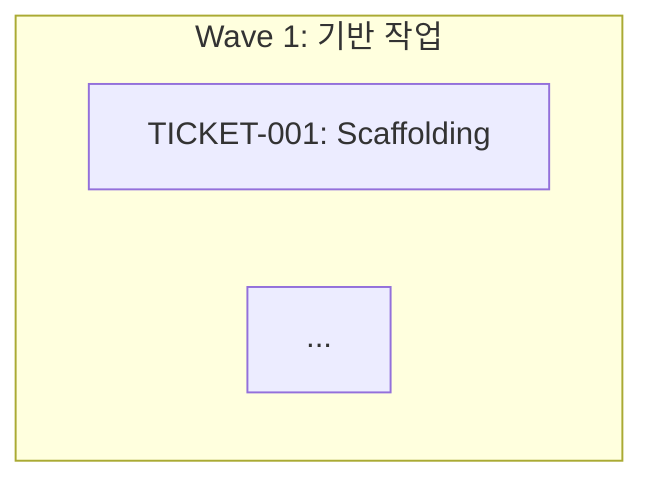
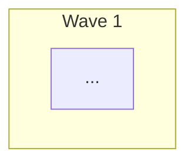

# 의존성 그래프 기능 제거 - 2025-12-27

## 📋 개요

PM Orchestrator 워크플로우에서 의존성 그래프 자동 생성 기능을 제거했습니다. Wave 기반 순차 실행과 티켓 내 Primary/Parallel 구조만으로도 충분한 의존성 관리가 가능하다고 판단했습니다.

## 🎯 제거 사유

### 1. **Wave 구조로 충분**
```yaml
Wave 1: 초기화 (선행 작업 없음)
  ↓
Wave 2: 인증 (Wave 1 완료 후)
  ↓
Wave 3: 상품 관리 (Wave 2 완료 후)
```
- Wave 자체가 큰 단위의 의존성 표현
- 대부분의 의존성은 Wave 레벨에서 처리 가능

### 2. **Primary/Parallel 구조**
```yaml
assigned_agents:
  primary:
    agent: "Backend Developer"

  parallel:
    - agent: "QA Engineer"
      depends_on_primary: true  # 티켓 내 의존성 제어
```
- 티켓 내에서 Primary → Parallel 순서 명확
- `depends_on_primary` 필드로 실행 순서 제어

### 3. **파일 충돌 자동 감지**
```yaml
TICKET-A outputs: ["src/auth/login.ts"]
TICKET-B outputs: ["src/auth/login.ts"]  # 충돌 감지 → 순차 실행
```
- 명시적 그래프 없이도 안전성 보장
- outputs 필드 비교로 자동 직렬화

### 4. **복잡도 감소**
- 의존성 그래프 생성/관리 로직 불필요
- Mermaid 그래프 파일 생성 불필요
- 시스템 단순화로 유지보수성 향상

## ✅ 수정된 파일

### 1. TypeScript 워크플로우

#### `src/constants/workflows/development/pm-orchestrator.ts`

**Line 5**: Description 수정
```yaml
# Before
description: "... 에이전트 할당, 의존성 그래프, Wave 구성까지 자동으로 수행합니다."

# After
description: "... 에이전트 할당, Wave 구성까지 자동으로 수행합니다."
```

**Line 31**: 경로 설정 삭제
```yaml
# Deleted
dev_dependency_graph: "{project-root}/anyon-docs/dev-plan/dependency-graph.md"
```

**Line 97**: Output 설정 삭제
```yaml
# Deleted
dependency_graph: "{paths:dev_dependency_graph}"
```

**Line 106**: 참조 변수 삭제
```yaml
# Deleted
dependency_graph_file: "{paths:dev_dependency_graph}"
```

**Line 1510-1536**: Step 4 의존성 그래프 생성 로직 삭제
```yaml
# Deleted
<action>의존성 그래프 생성 (Mermaid 형식):

</action>

<action>✅ {dependency_graph_file}에 자동 저장 완료</action>
```

**Line 1879-1897**: execution-plan.md 내 Mermaid 그래프 섹션 삭제
```yaml
# Deleted
**의존성 그래프** (Mermaid):

```

### 2. 문서 업데이트

#### `sdd-docs/features/template/basic/mvp-workspace/development/01-pm-orchestrator-workflow.md`

**Line 7-8**: 출력 파일 목록 수정
```markdown
# Before
**출력**: Epic 파일들, execution-plan.md, dependency-graph.md, api-spec.md

# After
**출력**: Epic 파일들, execution-plan.md, api-spec.md
```

**Line 13-24**: 워크플로우 다이어그램 수정
```mermaid
# Before
E --> F[Step 5: 에이전트 할당]
...
H --> K[dependency-graph.md]

# After
D --> E[Step 4: Wave 구성]
...
H --> K[api-spec.md]
```

**Line 370-377**: dependency-graph.md 섹션 삭제
```markdown
# Deleted
### 3. dependency-graph.md

**위치**: `anyon-docs/dev-plan/dependency-graph.md`

**내용**:
- Mermaid 형식 의존성 그래프
- Wave별 티켓 관계도
- 병렬 실행 가능 티켓 표시
```

#### `CHANGELOG-PM-ORCHESTRATOR.md`

**Line 168-176**: 수정 내역 추가
```markdown
- Line 5: description에서 "의존성 그래프" 제거
- Line 31: `dev_dependency_graph` 경로 삭제
- Line 97: `dependency_graph` 출력 설정 삭제
- Line 106: `dependency_graph_file` 참조 삭제
- Step 4: Wave 병렬 그룹 생성 (의존성 그래프 자동 생성 로직 제거)
```

**Line 243**: 검증 체크리스트 추가
```markdown
- [x] 문서 업데이트 (의존성 그래프 제거)
```

## 📊 대체 방안

의존성 그래프 대신 사용하는 메커니즘:

### 1. Wave 기반 실행
```yaml
Wave 1: 초기화
  - TICKET-001: Scaffolding
  - TICKET-002: DB Schema
  → blocked_by: []

Wave 2: 인증
  - TICKET-003: Auth API
  - TICKET-004: Login UI
  → blocked_by: [TICKET-001, TICKET-002]
```

### 2. 티켓 내 의존성
```yaml
TICKET-005:
  assigned_agents:
    primary:
      agent: "Backend Developer"

    parallel:
      - agent: "QA Engineer"
        depends_on_primary: true  # Primary 완료 후 실행
```

### 3. 파일 충돌 감지
```yaml
# PM Executor가 자동 감지
if outputs 교집합 존재:
    순차 실행
else:
    병렬 실행
```

### 4. Epic 파일 내 실행 순서
```yaml
# Epic 파일에 명시적 순서 기록
execution_order:
  - TICKET-001  # 먼저
  - TICKET-002  # 그 다음
  - [TICKET-003, TICKET-004]  # 병렬
```

## 🔄 마이그레이션

### 기존 프로젝트
- `dependency-graph.md` 파일 삭제 가능
- Wave 구조와 `depends_on_primary` 필드로 의존성 관리
- 파일 충돌은 `outputs` 필드로 자동 감지

### 새 프로젝트
- PM Orchestrator가 dependency-graph.md 생성하지 않음
- execution-plan.md에만 Wave별 실행 계획 포함
- 의존성은 Wave 순서로 표현

## ✅ 장점

1. **시스템 단순화**
   - 불필요한 파일 생성 제거
   - 코드 복잡도 감소

2. **유지보수성 향상**
   - 관리할 산출물 감소
   - 디버깅 포인트 감소

3. **성능 개선**
   - Mermaid 그래프 생성 시간 제거
   - 워크플로우 실행 속도 향상

4. **Wave 구조 강조**
   - Wave가 의존성 관리의 핵심
   - 티켓 간 관계 명확화

## 📝 결론

**의존성 그래프 제거 완료**:
- ✅ Wave 구조로 충분한 의존성 표현
- ✅ Primary/Parallel 구조로 티켓 내 의존성 처리
- ✅ 파일 충돌 자동 감지로 안전성 보장
- ✅ 시스템 복잡도 감소

**다음 단계**:
- 실제 프로젝트로 Wave 기반 실행 테스트
- 복잡한 의존성 케이스 검증
- 필요 시 Epic 레벨 `execution_order` 추가 고려

---

**작성일**: 2025-12-27
**관련 문서**:
- CHANGELOG-PM-ORCHESTRATOR.md
- sdd-docs/features/template/basic/mvp-workspace/development/01-pm-orchestrator-workflow.md
