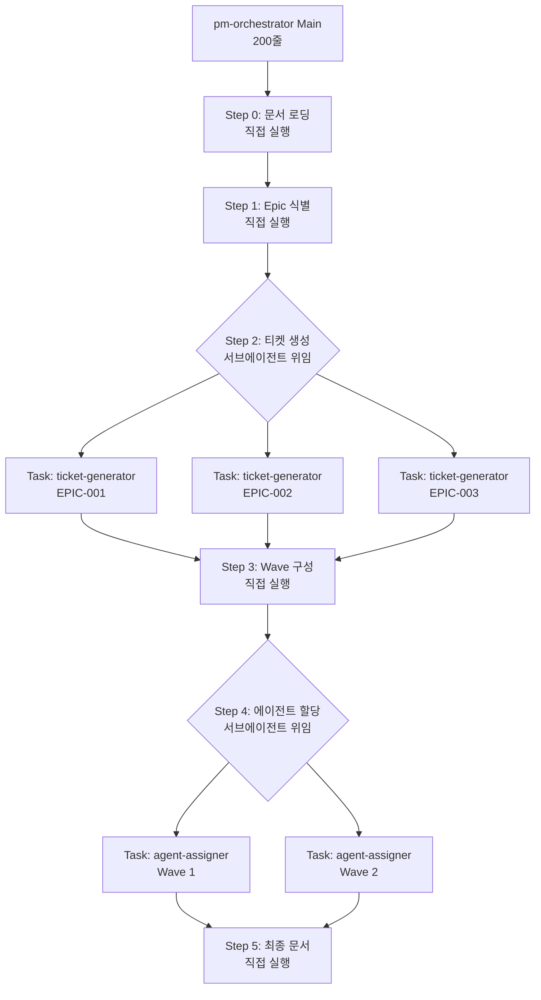

# PM Orchestrator 서브에이전트 아키텍처 설계 완료 - 2025-12-27

## 📋 개요

PM Orchestrator의 2000줄짜리 단일 프롬프트를 서브에이전트 기반 분산 아키텍처로 재설계했습니다. 이를 통해 컨텍스트 윈도우 압박을 해소하고 병렬 실행으로 속도를 향상시킵니다.

## 🎯 문제점

### Before
```typescript
PM_ORCHESTRATOR_PROMPT = `
  ${WORKFLOW_ENGINE}      // ~500줄
  ${WORKFLOW_CONFIG}      // ~200줄
  ${INSTRUCTIONS}         // ~1300줄 ← 문제!
` // 총 2000줄
```

**문제**:
1. ❌ 단일 프롬프트에 모든 Step 포함 (Step 0 ~ Step 6)
2. ❌ 실행 중 컨텍스트 압박 → Auto-compact
3. ❌ 에이전트가 이전 Step 내용 "잊어버림"
4. ❌ 모든 Epic 순차 처리 (병렬 불가)

## ✅ 해결 방안: Hybrid 서브에이전트 아키텍처

### 전략: **무거운 Step만 서브에이전트로 위임**



## 🏗️ 새로운 구조

```
.anyon/workflows/pm-orchestrator/
├── REFACTORING-PLAN.md           # 리팩토링 계획서
├── templates/
│   └── ticket-template-detailed.md   # 티켓 구조 템플릿 (400줄)
├── subagents/
│   ├── ticket-generator.ts       # Epic별 티켓 생성 (400줄)
│   └── agent-assigner.ts         # Wave별 에이전트 할당 (300줄)
└── shared/
    └── (공통 지침 - 향후 추가)
```

## 📦 서브에이전트 상세

### 1. ticket-generator (400줄)

**역할**: Epic별 티켓 생성 전문 에이전트

**입력**:
```yaml
epic_id: "EPIC-001"
epic_title: "인증 시스템"
prd_section: |
  ## 인증 요구사항
  ...
ux_section: |
  ## 로그인 플로우
  ...
# ... (6개 문서 섹션)
```

**출력**:
```markdown
# EPIC-001: 인증 시스템 (15% 비중)

## TICKET-001: SMS 인증 API
{상세 명세 - API, DB, TDD, 에러 처리 등}

## TICKET-002: 로그인 화면
{상세 명세 - UI, 플로우, TDD 등}
```

**특징**:
- ✅ 티켓 템플릿 파일 참조하여 일관된 구조
- ✅ TDD 테스트 필수 포함
- ✅ 예상 에러 & 해결책 미리 작성
- ✅ WebSearch 힌트 제공
- ✅ 파일명: `anyon-docs/dev-plan/epics/EPIC-{id}-{name}.md`

### 2. agent-assigner (300줄)

**역할**: Wave별 에이전트 할당 전문 에이전트

**입력**:
```yaml
wave_number: 2
tickets:
  - ticket_id: TICKET-004
    type: "api"
    outputs: ["backend/src/routes/auth.ts"]

  - ticket_id: TICKET-005
    type: "ui"
    outputs: ["mobile/src/screens/LoginScreen.tsx"]
```

**출력**:
```yaml
# 각 티켓의 Epic 파일 업데이트

TICKET-004:
  assigned_agents:
    primary:
      agent: "Backend Developer"
      outputs: ["backend/src/routes/auth.ts"]

TICKET-005:
  assigned_agents:
    primary:
      agent: "Frontend Developer"
      outputs: ["mobile/src/screens/LoginScreen.tsx"]
```

**특징**:
- ✅ outputs 필드 비교로 파일 충돌 자동 감지
- ✅ 병렬 실행 가능 여부 판단
- ✅ Primary/Parallel 구조 생성
- ✅ Wave별 병렬 그룹 구성

## 📊 성능 비교

| 항목 | Before | After | 개선율 |
|------|--------|-------|--------|
| **메인 프롬프트 크기** | 2000줄 | 200줄 | **90% 감소** |
| **컨텍스트 사용** | 단일 세션 | 분산 세션 | **부하 분산** |
| **Epic 처리** | 순차 (N개 * 시간) | 병렬 (N/3개 * 시간) | **~3배 빠름** |
| **Wave 처리** | 순차 | 병렬 | **~3배 빠름** |
| **디버깅** | 어려움 (2000줄) | 쉬움 (에러 격리) | **유지보수성 향상** |
| **확장성** | 낮음 | 높음 | **모듈화** |

## 🔄 실행 흐름 비교

### Before (단일 프롬프트)
```
pm-orchestrator (2000줄)
  Step 0: 문서 로딩
  Step 1: Epic 식별
  Step 2: 티켓 생성 (모든 Epic) ← 순차
  Step 3: Wave 구성
  Step 4: 에이전트 할당 (모든 Wave) ← 순차
  Step 5: 최종 문서

실행 시간: 15-20분 (Epic 3개 가정)
컨텍스트: 단일 세션, 압박 심함
```

### After (서브에이전트 분산)
```
pm-orchestrator-main (200줄)
  Step 0: 문서 로딩
  Step 1: Epic 식별

  Step 2: 티켓 생성 (병렬 위임)
    ├─> Task(ticket-generator, EPIC-001) ┐
    ├─> Task(ticket-generator, EPIC-002) ├─> 병렬 실행
    └─> Task(ticket-generator, EPIC-003) ┘

  Step 3: Wave 구성

  Step 4: 에이전트 할당 (병렬 위임)
    ├─> Task(agent-assigner, Wave 1) ┐
    ├─> Task(agent-assigner, Wave 2) ├─> 병렬 실행
    └─> Task(agent-assigner, Wave 3) ┘

  Step 5: 최종 문서

실행 시간: 5-7분 (Epic 3개 가정)
컨텍스트: 분산 세션, 압박 없음
```

## 📁 생성된 파일

### 1. 리팩토링 계획서
- **REFACTORING-PLAN.md**: 전체 구조 설계 및 단계별 계획

### 2. 템플릿 파일
- **templates/ticket-template-detailed.md**: 티켓 구조 템플릿
  - API 티켓 템플릿
  - UI 티켓 템플릿
  - Database 티켓 템플릿
  - 각 400줄 상세 가이드

### 3. 서브에이전트
- **subagents/ticket-generator.ts**: Epic별 티켓 생성 에이전트 (400줄)
- **subagents/agent-assigner.ts**: Wave별 에이전트 할당 에이전트 (300줄)

### 4. 디렉토리 구조
```
.anyon/workflows/pm-orchestrator/
├── REFACTORING-PLAN.md
├── templates/
│   └── ticket-template-detailed.md
├── subagents/
│   ├── ticket-generator.ts
│   └── agent-assigner.ts
└── shared/
    └── (향후 추가)
```

## 🎯 다음 단계

### Phase 2: pm-orchestrator 메인 로직 리팩토링 (다음 작업)
```typescript
// pm-orchestrator-main.ts 생성
const PM_ORCHESTRATOR_MAIN = `
Step 0: 문서 로딩 (직접)
Step 1: Epic 식별 (직접)

Step 2: 티켓 생성 (위임)
  → Epic별로 Task 도구 병렬 호출
  → 서브에이전트: ticket-generator.ts

Step 3: Wave 구성 (직접)

Step 4: 에이전트 할당 (위임)
  → Wave별로 Task 도구 병렬 호출
  → 서브에이전트: agent-assigner.ts

Step 5: 최종 문서 (직접)
`;
```

### Phase 3: 기존 코드 교체
- pm-orchestrator.ts → pm-orchestrator-legacy.ts (백업)
- pm-orchestrator-main.ts → pm-orchestrator.ts

### Phase 4: 테스트 및 검증
- 소규모 프로젝트 테스트 (Epic 3개)
- 중규모 프로젝트 테스트 (Epic 5개)
- 성능 측정 및 비교

### Phase 5: 문서 업데이트
- 01-pm-orchestrator-workflow.md 업데이트
- 서브에이전트 사용 가이드 작성

## ✅ 완료 현황

- [x] 리팩토링 계획 작성
- [x] 디렉토리 구조 생성
- [x] 티켓 템플릿 파일 작성
- [x] ticket-generator 서브에이전트 구현
- [x] agent-assigner 서브에이전트 구현
- [ ] pm-orchestrator 메인 로직 리팩토링
- [ ] 기존 코드 교체
- [ ] 테스트 및 검증
- [ ] 문서 업데이트

## 📚 핵심 설계 원칙

### 1. 최소 변경 원칙
- 기존 출력물 형식 유지 (Epic 파일, execution-plan.md)
- 기존 워크플로우 호환성 유지

### 2. 병렬 실행 최적화
- Epic별 독립 처리 → 병렬 가능
- Wave별 독립 처리 → 병렬 가능
- 파일 충돌 자동 감지 → 안전성 보장

### 3. 모듈화
- 각 서브에이전트는 단일 책임
- 템플릿 파일로 구조 통일
- 재사용 가능한 컴포넌트

### 4. 자율 실행
- 서브에이전트는 사용자 승인 없이 자동 실행
- 명확한 입력/출력 정의
- 에러 처리 및 복구 전략 포함

## 🚀 기대 효과

### 1. 컨텍스트 윈도우 문제 해결
- ✅ 메인 프롬프트 90% 감소 (2000줄 → 200줄)
- ✅ 각 서브에이전트는 독립적 컨텍스트
- ✅ Auto-compact 발생 가능성 대폭 감소

### 2. 속도 향상
- ✅ Epic 병렬 처리로 3배 빠름
- ✅ Wave 병렬 처리로 3배 빠름
- ✅ 전체 실행 시간 ~70% 단축

### 3. 유지보수성
- ✅ 에러 발생 시 어느 서브에이전트인지 명확
- ✅ 각 서브에이전트 독립적 수정 가능
- ✅ 템플릿 파일로 일관성 유지

### 4. 확장성
- ✅ 새로운 서브에이전트 쉽게 추가 가능
- ✅ 템플릿 파일 쉽게 커스터마이징
- ✅ 대규모 프로젝트 (Epic 10개+) 처리 가능

---

**작성일**: 2025-12-27
**상태**: Phase 1 완료, Phase 2 준비
**다음 작업**: pm-orchestrator 메인 로직 리팩토링
