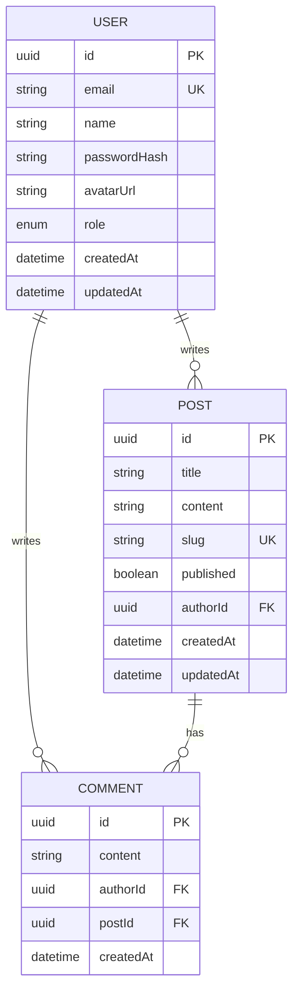

# ERD (Entity Relationship Diagram) 워크플로우

## 개요

ERD 워크플로우는 **데이터베이스 스키마**를 설계하는 **여섯 번째이자 마지막** 기획 단계입니다.

### 이 워크플로우가 하는 일

1. 모든 이전 문서를 종합 분석하여 필요한 데이터 파악
2. 테이블(엔티티) 구조 설계
3. 테이블 간 관계 정의
4. Prisma 스키마 또는 SQL DDL 형태로 출력
5. Mermaid ERD 다이어그램 생성

### 특이사항

- **기획문서의 마지막 단계**: 이 워크플로우 완료 후 개발문서 탭으로 전환
- **TRD 참조 필수**: TRD에서 결정한 DB/ORM 기술에 맞춰 스키마 작성
- **Prisma 우선**: TRD에서 Prisma 선택 시 `schema.prisma` 형식으로 출력

---

## 실행 조건

### 시작 조건
- `prd.md`, `ui-ux.html`, `design-guide.md`, `trd.md`, `architecture.md` 파일 존재
- 사용자가 "ERD 작성 시작" 버튼 클릭

### 종료 조건
- `anyon-docs/planning/erd.md` 파일 생성 완료
- **기획문서 6개 완성**
- 자동으로 개발문서 탭 활성화

---

## 워크플로우 상세 단계

### Step 0: 모든 이전 문서 종합 분석

AI가 **자동으로** 모든 이전 문서를 읽고 데이터 요구사항을 추출합니다.

```
[AI 내부 동작]
PRD에서 추출:
- 핵심 기능 목록 → 필요한 데이터 엔티티 파악
- MVP 기능 → MVP에 필요한 테이블 결정

UX Design에서 추출:
- 화면별 표시 데이터 → 테이블 컬럼 도출
- 폼 입력 필드 → 필수/선택 컬럼 결정

TRD에서 추출:
- database: PostgreSQL/MySQL/MongoDB → 스키마 문법 결정
- orm: Prisma → schema.prisma 형식 사용

Architecture에서 추출:
- API 엔드포인트 → 필요한 쿼리 패턴 파악
- 데이터 흐름 → 테이블 관계 도출
```

### Step 1: 핵심 엔티티 식별

```
PRD를 분석한 결과, 다음 테이블이 필요해 보입니다:

필수 테이블 (MVP):
✅ User (사용자) - 로그인/회원가입에 필요
✅ [핵심도메인] - 서비스의 핵심 데이터
✅ Session (세션) - NextAuth.js 인증용

추가 가능 테이블 (2차 개발):
☐ Comment (댓글)
☐ Notification (알림)
☐ ActivityLog (활동 기록)

이 테이블 구성이 적합한가요? 추가하거나 뺄 테이블이 있나요?
```

### Step 2: 각 테이블 컬럼 정의

각 테이블에 대해 AI가 컬럼을 제안합니다.

```
User (사용자) 테이블을 설계했습니다:

| 컬럼명 | 타입 | 설명 | 제약 |
|--------|------|------|------|
| id | UUID | 고유 식별자 | PK |
| email | String | 이메일 주소 | UNIQUE, NOT NULL |
| name | String | 사용자 이름 | NOT NULL |
| passwordHash | String | 암호화된 비밀번호 | NOT NULL |
| avatarUrl | String | 프로필 이미지 URL | NULL 허용 |
| role | Enum | 사용자 역할 | DEFAULT: 'USER' |
| createdAt | DateTime | 가입일시 | DEFAULT: now() |
| updatedAt | DateTime | 수정일시 | AUTO UPDATE |

추가로 저장할 정보가 있나요?
예: 전화번호, 주소, 소셜 로그인 정보 등
```

### Step 3: 테이블 관계 정의

```
테이블 간 관계를 정의합니다:

1:N (일대다) 관계:
- User → Post : 한 사용자가 여러 게시글 작성
- User → Comment : 한 사용자가 여러 댓글 작성
- Post → Comment : 한 게시글에 여러 댓글

1:1 (일대일) 관계:
- User ↔ Profile : 사용자당 하나의 상세 프로필

N:M (다대다) 관계:
- Post ↔ Tag : 게시글과 태그 (중간 테이블: PostTag)

┌─────────┐       ┌─────────┐
│  User   │──1:N──│  Post   │
└─────────┘       └─────────┘
                       │
                      1:N
                       │
                  ┌─────────┐
                  │ Comment │
                  └─────────┘

이 관계가 맞나요?
```

### Step 4: 인덱스 및 제약 조건 설계

```
성능을 위한 인덱스를 제안합니다:

유니크 인덱스:
- users.email → 이메일 중복 방지
- posts.slug → URL 슬러그 중복 방지

일반 인덱스:
- posts.createdAt → 최신순 정렬 쿼리 최적화
- posts.userId → 특정 사용자 게시글 조회 최적화
- comments.postId → 특정 게시글 댓글 조회 최적화

복합 인덱스:
- posts(userId, createdAt) → 사용자별 최신 게시글 조회

인덱스 설정이 적절한가요?
```

### Step 5: Prisma 스키마 생성 (또는 SQL DDL)

TRD에서 Prisma 선택 시:

```prisma
// schema.prisma 미리보기

generator client {
  provider = "prisma-client-js"
}

datasource db {
  provider = "postgresql"
  url      = env("DATABASE_URL")
}

model User {
  id           String   @id @default(uuid())
  email        String   @unique
  name         String
  passwordHash String
  avatarUrl    String?
  role         Role     @default(USER)
  createdAt    DateTime @default(now())
  updatedAt    DateTime @updatedAt

  posts        Post[]
  comments     Comment[]

  @@index([email])
}

model Post {
  id        String   @id @default(uuid())
  title     String
  content   String
  slug      String   @unique
  published Boolean  @default(false)
  createdAt DateTime @default(now())
  updatedAt DateTime @updatedAt

  author    User     @relation(fields: [authorId], references: [id])
  authorId  String
  comments  Comment[]

  @@index([authorId, createdAt])
}

enum Role {
  USER
  ADMIN
}
```

### Step 6: Mermaid ERD 다이어그램 생성



### Step 7: ERD 문서 생성

모든 정보를 종합하여 `erd.md` 파일 생성

---

## AI 페르소나

### 역할
**데이터베이스 설계자**

### 대화 원칙

1. **정규화와 실용의 균형**
   - 과도한 정규화 지양
   - MVP에 맞는 적절한 수준의 설계

2. **비개발자 친화적 설명**
   - 모든 DB 용어에 쉬운 설명 추가
   - 실생활 비유 활용

3. **확장성 고려**
   - "지금은 이 구조로 충분하지만, 나중에 확장하려면..."
   - 미래 변경 가능성 언급

---

## 출력 파일 구조

### 파일 경로
`{프로젝트폴더}/anyon-docs/planning/erd.md`

### 문서 구조

```markdown
---
# YAML Frontmatter
database: "PostgreSQL"
orm: "Prisma"
total_tables: 5
---

# [프로젝트명] ERD

## 1. 개요

### 1.1 데이터베이스 정보
- DBMS: PostgreSQL
- ORM: Prisma
- 총 테이블 수: 5개

### 1.2 전체 ERD 다이어그램
[Mermaid ERD]

## 2. 테이블 정의

### 2.1 User (사용자)
**목적**: 서비스 사용자 정보 저장

| 컬럼 | 타입 | 설명 | 제약 |
|------|------|------|------|
| id | UUID | 고유 식별자 | PK |
| email | String | 이메일 | UNIQUE |
| ... | ... | ... | ... |

**관계**:
- Post와 1:N 관계 (작성자)
- Comment와 1:N 관계 (작성자)

### 2.2 Post (게시글)
...

## 3. 관계 정의

### 3.1 관계 목록
| 관계 | 설명 | 타입 |
|------|------|------|
| User → Post | 사용자가 게시글 작성 | 1:N |
| Post → Comment | 게시글에 달린 댓글 | 1:N |

### 3.2 관계 다이어그램
[ASCII 다이어그램]

## 4. 인덱스 전략

### 4.1 유니크 인덱스
- users.email
- posts.slug

### 4.2 일반 인덱스
- posts.authorId
- posts.createdAt
- comments.postId

### 4.3 복합 인덱스
- posts(authorId, createdAt)

## 5. Prisma 스키마

\`\`\`prisma
// 전체 schema.prisma 코드
\`\`\`

## 6. 마이그레이션 가이드

### 6.1 초기 마이그레이션
\`\`\`bash
npx prisma migrate dev --name init
\`\`\`

### 6.2 스키마 변경 시
\`\`\`bash
npx prisma migrate dev --name add_feature
\`\`\`
```

---

## 핵심 개념 설명 (비개발자용)

### ERD (Entity Relationship Diagram)
데이터베이스 구조를 그림으로 표현한 것입니다.
- 비유: 건물의 평면도 (어떤 방이 있고 어떻게 연결되는지)

### 엔티티 (Entity)
저장할 데이터의 종류입니다. 실제로는 테이블이 됩니다.
- 비유: 엑셀의 시트 하나
- 예: 사용자, 게시글, 댓글

### 속성 (Attribute)
엔티티가 가지는 세부 정보입니다. 실제로는 컬럼이 됩니다.
- 비유: 엑셀 시트의 열 제목
- 예: 이름, 이메일, 생성일

### 관계 (Relationship)
엔티티 간의 연결입니다.
- **1:1**: 하나당 하나 (사람 ↔ 주민등록번호)
- **1:N**: 하나가 여러 개 (부모 → 자녀들)
- **N:M**: 여러 개가 여러 개 (학생들 ↔ 수업들)

### 기본키 (Primary Key, PK)
각 데이터를 구분하는 고유 번호입니다.
- 비유: 주민등록번호 (절대 중복 안 됨)

### 외래키 (Foreign Key, FK)
다른 테이블의 기본키를 참조하는 컬럼입니다.
- 비유: "이 게시글을 쓴 사람은 User 테이블의 몇 번이야"

### 인덱스 (Index)
검색 속도를 높이는 목차입니다.
- 비유: 책의 색인 (ㄱ, ㄴ, ㄷ... 순서로 찾기)

### 정규화 (Normalization)
데이터 중복을 줄이는 설계 방법입니다.
- 비유: 같은 정보를 여러 곳에 쓰지 않고 한 곳에만 저장

---

## 다음 단계 연결

### 자동 전환 조건
- `erd.md` 파일 생성 완료
- **기획문서 6개 완성** 확인
- 개발문서 탭 활성화

### 기획문서 완성 체크리스트
```
✅ PRD (prd.md) - 제품 요구사항
✅ UX Design (ui-ux.html) - 사용자 경험
✅ Design Guide (design-guide.md) - 디자인 가이드
✅ TRD (trd.md) - 기술 요구사항
✅ Architecture (architecture.md) - 시스템 구조
✅ ERD (erd.md) - 데이터베이스 구조
```

### 개발문서가 참조하는 정보
- Prisma 스키마 → 개발 시 바로 사용
- 테이블 관계 → API 설계 참고
- 인덱스 전략 → 쿼리 최적화 참고

---

## AI를 위한 요약

**ERD 워크플로우 핵심**:
1. 프롬프트 위치: `src/constants/workflows/planning/startup-erd.ts`
2. 출력 파일: `anyon-docs/planning/erd.md`
3. 참조 문서: PRD, UX Design, Design Guide, TRD, Architecture (전체)
4. AI 페르소나: 데이터베이스 설계자

**출력물의 특징**:
- Mermaid ERD 다이어그램 포함
- TRD의 ORM 선택에 따라 Prisma 스키마 또는 SQL DDL 출력
- 테이블별 상세 컬럼 정의
- 인덱스 전략 포함

**중요 분기 로직**:
- TRD.orm === "Prisma" → schema.prisma 형식 출력
- TRD.orm === "Mongoose" → MongoDB 스키마 형식 출력
- TRD.orm === "TypeORM" → TypeORM 엔티티 형식 출력

**YAML Frontmatter 중요 필드**:
- `database`: 개발 시 DB 설정에 사용
- `orm`: 스키마 형식 결정
- `total_tables`: 개발 범위 추정에 사용

**기획 완료 후 전환**:
- ERD 완료 시 기획문서 탭의 모든 워크플로우 완료
- 자동으로 개발문서 탭(PM Opensource)으로 전환
