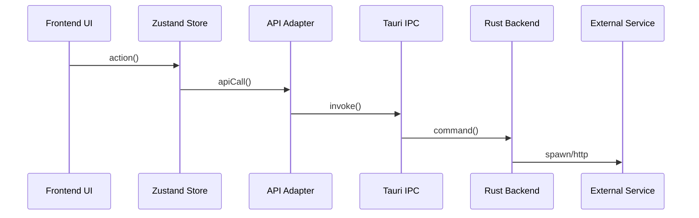

# AI 컨텍스트 관리 시스템 설계

> Claude Code가 코드 수정 시 전체 맥락을 파악하고, 레거시/중복 코드 생성을 방지하기 위한 시스템

---

## 문제 정의

현재 Claude Code 워크플로우:
```
"코드 고쳐줘" → 위치 찾기 → 해당 코드만 파악 → 수정
```

**문제점:**
- 전체 아키텍처 모름 → 잘못된 패턴 사용
- 기존 유틸리티 모름 → 중복 함수 생성
- 코딩 규칙 모름 → 일관성 없는 코드
- 연관 코드 모름 → 사이드 이펙트 발생

---

## 해결 전략

### 3-Layer 컨텍스트 시스템

```
┌─────────────────────────────────────────────────────┐
│  Layer 1: 헌법 (Constitution)                        │
│  CLAUDE.md - 반드시 따라야 할 규칙                    │
│  "~하기 전에 반드시 ~를 확인하라"                      │
└─────────────────────────────────────────────────────┘
                         ↓
┌─────────────────────────────────────────────────────┐
│  Layer 2: 흐름 (Flows)                               │
│  sdd-docs/flows/ - 기능별 코드 흐름                   │
│  "이 기능은 A → B → C로 연결된다"                     │
└─────────────────────────────────────────────────────┘
                         ↓
┌─────────────────────────────────────────────────────┐
│  Layer 3: 레퍼런스 (Reference)                       │
│  sdd-docs/specs/ - 상세 API, 컴포넌트, 타입 정보      │
│  "이 함수의 시그니처는 ~이다" (기존 문서)              │
└─────────────────────────────────────────────────────┘
```

---

## Layer 1: 헌법 (CLAUDE.md 개선)

### 추가할 섹션

```markdown
## AI 개발 규칙 (필수 준수)

### 코드 수정 전 필수 단계
1. **유사 코드 검색**: 수정하려는 기능과 비슷한 기존 구현 먼저 찾기
2. **흐름 문서 확인**: `sdd-docs/flows/`에서 관련 기능의 전체 흐름 파악
3. **패턴 학습**: 기존 코드의 패턴을 따라 구현

### 금지 사항
- ❌ 유틸리티 함수 새로 만들기 전 `src/lib/` 확인 없이 생성
- ❌ API 호출 패턴을 `src/lib/api/` 패턴과 다르게 구현
- ❌ 상태 관리를 Zustand store 외의 방식으로 구현
- ❌ 스타일을 Tailwind + shadcn/ui 외의 방식으로 구현

### 코드 위치 규칙
| 유형 | 위치 | 예시 |
|------|------|------|
| React 컴포넌트 | `src/components/` | `SessionList.tsx` |
| UI 원자 컴포넌트 | `src/components/ui/` | `Button.tsx` |
| 커스텀 훅 | `src/hooks/` | `useTabState.ts` |
| API 호출 | `src/lib/api/` | `sessions.ts` |
| 유틸리티 | `src/lib/` | `utils.ts` |
| Zustand 스토어 | `src/stores/` | `sessionStore.ts` |
| Tauri 명령 | `src-tauri/src/commands/` | `claude/execution.rs` |

### 주요 코드 흐름 레퍼런스
| 기능 | 흐름 문서 |
|------|----------|
| Claude 실행 | `sdd-docs/flows/claude-execution.md` |
| 에이전트 실행 | `sdd-docs/flows/agent-execution.md` |
| 인증 | `sdd-docs/flows/authentication.md` |
| 프로젝트 관리 | `sdd-docs/flows/project-management.md` |
| 모델 선택 | `sdd-docs/flows/model-selection.md` |
```

---

## Layer 2: 흐름 문서 (sdd-docs/flows/)

### 폴더 구조

```
sdd-docs/flows/
├── README.md                    # 흐름 문서 작성 가이드
├── _template.md                 # 흐름 문서 템플릿
│
├── claude-execution.md          # Claude Code 실행 전체 흐름
├── agent-execution.md           # 에이전트 실행 흐름
├── model-selection.md           # 모델 선택 (오늘 버그 케이스)
├── authentication.md            # 로그인/인증 흐름
├── project-management.md        # 프로젝트 CRUD
├── session-management.md        # 세션 관리
├── mcp-server-management.md     # MCP 서버 관리
└── settings-management.md       # 설정 관리
```

### 흐름 문서 템플릿 (`_template.md`)

```markdown
# [기능명] 코드 흐름

## 개요
[기능에 대한 1-2문장 설명]

## 시퀀스 다이어그램



## 코드 경로

### 1. Frontend (UI → State)
| 단계 | 파일 | 함수/컴포넌트 | 설명 |
|------|------|---------------|------|
| 1 | `src/components/X.tsx` | `handleClick()` | 사용자 액션 |
| 2 | `src/stores/xStore.ts` | `doSomething()` | 상태 업데이트 |

### 2. API Layer (State → IPC)
| 단계 | 파일 | 함수 | Tauri 명령 |
|------|------|------|-----------|
| 3 | `src/lib/api/x.ts` | `executeX()` | `execute_x` |

### 3. Backend (IPC → External)
| 단계 | 파일 | 함수 | 설명 |
|------|------|------|------|
| 4 | `src-tauri/src/commands/x.rs` | `execute_x()` | IPC 핸들러 |
| 5 | `src-tauri/src/commands/x.rs` | `spawn_process()` | 외부 프로세스 |

## 상태 변화

| 시점 | Store | 값 |
|------|-------|-----|
| 초기 | `xStore.status` | `"idle"` |
| 실행 중 | `xStore.status` | `"running"` |
| 완료 | `xStore.status` | `"completed"` |

## 이벤트 흐름

| 이벤트 | 발생 위치 | 수신 위치 |
|--------|----------|----------|
| `x-started` | `x.rs:123` | `X.tsx:45` |
| `x-output` | `x.rs:156` | `X.tsx:67` |

## 에러 처리

| 에러 유형 | 발생 위치 | 처리 방식 |
|----------|----------|----------|
| Network | `api/x.ts` | Toast + Retry |
| Validation | `X.tsx` | Form error |

## 관련 문서
- [API 계약](../specs/api-contracts.md#execute_x)
- [컴포넌트](../specs/component-inventory.md#x-component)
```

### 예시: 모델 선택 흐름 (`model-selection.md`)

```markdown
# 모델 선택 코드 흐름

## 개요
사용자가 AI 채팅에서 모델(Haiku/Sonnet/Opus)을 선택하면 Claude Code CLI에 전달되는 흐름

## 코드 경로

### 1. Frontend (UI)
| 단계 | 파일 | 위치 | 설명 |
|------|------|------|------|
| 1 | `FloatingPromptInput.tsx` | L206-231 | `MODELS` 배열 정의 |
| 2 | `FloatingPromptInput.tsx` | L292 | `selectedModel` 상태 |
| 3 | `FloatingPromptInput.tsx` | L1275 | 버튼 텍스트 표시 |
| 4 | `FloatingPromptInput.tsx` | L1293 | `setSelectedModel()` |

### 2. API Layer
| 단계 | 파일 | 함수 | Tauri 명령 |
|------|------|------|-----------|
| 5 | `src/lib/api/sessions.ts` | `executeClaudeCode()` | `execute_claude_code` |

### 3. Backend
| 단계 | 파일 | 위치 | 설명 |
|------|------|------|------|
| 6 | `commands/claude/execution.rs` | L31-32 | `--model` 플래그 추가 |
| 7 | CLI 실행 | - | `claude -p "..." --model haiku` |

## 주의사항
- 버튼 텍스트는 `selectedModelData.name` 사용 (하드코딩 금지)
- 모델 ID는 "haiku", "sonnet", "opus" 문자열 그대로 CLI에 전달됨
```

---

## Layer 3: 심볼 관계 매핑

### api-contracts.md 개선

기존 API 문서에 **호출자 정보** 추가:

```markdown
### execute_claude_code

| 속성 | 값 |
|------|-----|
| **명령** | `execute_claude_code` |
| **파라미터** | `projectPath`, `prompt`, `model`, `executionMode` |
| **반환** | `void` (스트리밍) |
| **호출자** | `sessionsApi.executeClaudeCode()` → `FloatingPromptInput`, `ClaudeCodeSession` |
| **구현** | `src-tauri/src/commands/claude/execution.rs:execute_claude_code()` |
| **이벤트** | `claude-output:{sessionId}`, `claude-complete:{sessionId}` |
```

### component-inventory.md 개선

기존 컴포넌트 문서에 **의존성 정보** 추가:

```markdown
### FloatingPromptInput

| 속성 | 값 |
|------|-----|
| **위치** | `src/components/FloatingPromptInput.tsx` |
| **용도** | 프롬프트 입력 + 모델/실행모드 선택 |
| **Hooks** | `useState`, `useRef`, `useCallback` |
| **Stores** | - |
| **API 호출** | `sessionsApi.executeClaudeCode()`, `sessionsApi.continueClaudeCode()` |
| **Props 전달** | `ClaudeCodeSession` → `FloatingPromptInput` |
| **주요 상태** | `selectedModel`, `selectedThinkingMode`, `prompt` |
```

---

## 자동화 시스템

### Phase 1: 수동 + 템플릿 (즉시)
- 흐름 문서 템플릿 제공
- 주요 기능 5개 흐름 문서 수동 작성
- CLAUDE.md 헌법 규칙 추가

### Phase 2: Drift 감지 (단기)
- 코드 변경 시 관련 흐름 문서 outdated 경고
- `sync-status.json`에 flows/ 추가

### Phase 3: 자동 생성 (장기)
- Tree-sitter 기반 심볼 그래프 자동 생성
- 함수 호출 관계 자동 추출
- Mermaid 다이어그램 자동 생성

---

## 적용 우선순위

| 순서 | 작업 | 효과 | 난이도 |
|------|------|------|--------|
| 1 | CLAUDE.md 헌법 규칙 추가 | 즉시 AI 행동 변화 | 쉬움 |
| 2 | flows/ 폴더 + 템플릿 생성 | 구조 확립 | 쉬움 |
| 3 | 주요 기능 5개 흐름 문서 작성 | 핵심 컨텍스트 제공 | 중간 |
| 4 | 기존 specs/ 문서에 호출자 정보 추가 | 심볼 관계 파악 | 중간 |
| 5 | Drift 감지 시스템 | 문서 최신성 유지 | 어려움 |

---

## 기대 효과

### Before
```
User: "모델 선택 버그 고쳐줘"
Claude: (코드 검색) → (해당 파일만 파악) → (하드코딩된 값 수정)
결과: 다른 곳에서 같은 패턴 반복 가능성
```

### After
```
User: "모델 선택 버그 고쳐줘"
Claude:
1. (헌법) "흐름 문서 먼저 확인"
2. (flows/model-selection.md) 전체 흐름 파악
3. (코드 수정) 패턴에 맞게 수정
4. (검증) 연관된 다른 코드 확인
결과: 일관된 패턴, 사이드 이펙트 방지
```

---

## 다음 단계

1. [ ] 이 설계 문서 검토 및 승인
2. [ ] CLAUDE.md 헌법 규칙 추가
3. [ ] flows/ 폴더 및 템플릿 생성
4. [ ] model-selection.md 샘플 작성 (오늘 버그 케이스)
5. [ ] claude-execution.md 작성 (가장 중요한 흐름)
