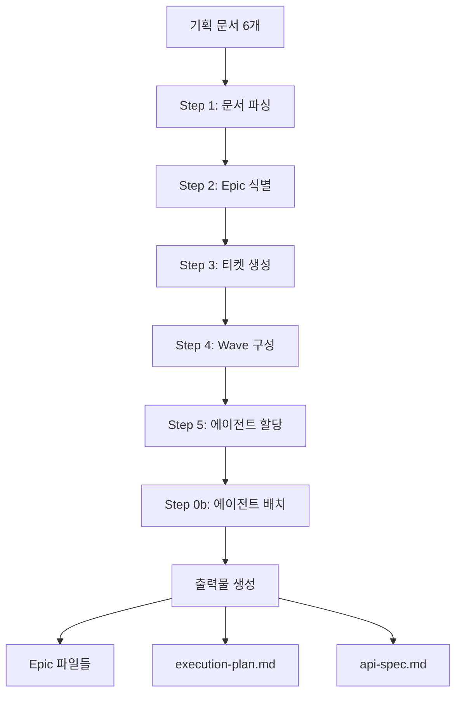

# PM Orchestrator Workflow - 개발 티켓 생성

## 📋 개요

PM Orchestrator는 6개 기획 문서를 분석하여 개발 티켓과 실행 계획을 자동 생성하는 워크플로우입니다.

**입력**: PRD, UX, UI, TRD, Architecture, ERD (6개 기획 문서)
**출력**: Epic 파일들, execution-plan.md, api-spec.md

## 🔄 워크플로우 흐름



## 📂 입력 문서

### 필수 문서 (6개)

| 문서 | 경로 | 역할 |
|------|------|------|
| PRD | `anyon-docs/planning/prd.md` | 제품 요구사항, 비즈니스 로직 |
| UX | `anyon-docs/planning/ui-ux.html` | 사용자 플로우, 와이어프레임 |
| UI | `anyon-docs/planning/design-guide.md` | 디자인 가이드, 스타일 |
| TRD | `anyon-docs/planning/trd.md` | 기술 스택, 도구 |
| Architecture | `anyon-docs/planning/architecture.md` | 시스템 설계, 컨벤션 |
| ERD | `anyon-docs/planning/erd.md` | 데이터베이스 스키마 |

## 🎯 주요 단계

### Step 0b: 에이전트 배치 (NEW)

**목적**: 프로젝트별 커스터마이징된 에이전트 생성

**프로세스**:
```yaml
1. 에이전트 템플릿 스캔
   경로: .anyon/agents/
   파일: backend-developer.md, frontend-developer.md, etc.

2. 문서 분석 → 변수 추출
   TRD 분석:
     - tech_stack.language: "TypeScript"
     - tech_stack.framework: "Next.js 14"
     - tech_stack.database: "PostgreSQL"

   Architecture 분석:
     - conventions.api_response_format: "{ success, data, error }"
     - conventions.folder_structure: "/app/api/"

   PRD 분석:
     - domain_knowledge: ["펫시터 매칭", "예약 시스템"]

3. 템플릿 주입
   템플릿 READ → 플레이스홀더 치환 → .claude/agents/ WRITE

   예시:
   <!-- pm-orchestrator가 TRD 분석 후 자동 주입 -->
   ↓
   - **Language**: TypeScript
   - **Framework**: Next.js 14
   - **Database**: PostgreSQL

4. 에이전트 배치
   기본 8개 에이전트 항상 배치:
   - scaffolding-engineer
   - backend-developer
   - frontend-developer
   - database-architect
   - integration-engineer
   - devops-engineer
   - qa-engineer
   - security-auditor
```

**출력**: `.claude/agents/` 폴더에 커스터마이징된 에이전트 파일

### Step 1: 문서 파싱

6개 기획 문서를 읽고 구조화된 데이터로 변환

**추출 정보**:
- PRD: 기능 목록, 비즈니스 규칙, 참고 오픈소스
- UX/UI: 화면 구조, 사용자 플로우, 디자인 가이드
- TRD: 기술 스택, 개발 도구
- Architecture: 폴더 구조, API 설계, 컨벤션
- ERD: 엔티티, 관계, 제약조건

### Step 2: Epic 식별

기능을 Epic으로 그룹핑

**Epic 분류 기준**:
1. **인증/사용자 관리** - 로그인, 회원가입, 프로필
2. **핵심 도메인 기능** - PRD의 주요 기능들
3. **협업/소셜 기능** - 팀, 초대, 공유, 알림
4. **관리자 기능** - 대시보드, 통계
5. **인프라** - 프로젝트 설정, CI/CD
6. **품질 보증** - 테스트, 보안

**출력**: Epic 목록 및 각 Epic의 비중(%)

### Step 3: 티켓 생성 (병렬 실행 구조)

각 Epic을 세부 티켓으로 분해

**티켓 타입**:
- `scaffolding` - 프로젝트 초기 구조
- `database` - 스키마, 마이그레이션
- `api` - 백엔드 API
- `ui` - 프론트엔드 화면
- `integration` - 외부 서비스 연동
- `cicd` - CI/CD 파이프라인
- `test` - 테스트 작성
- `security` - 보안 검토

**NEW: 병렬 실행 구조**

```yaml
assigned_agents:
  primary:
    agent: "Backend Developer"
    responsibility: "Product API 엔드포인트 구현"
    outputs: ["backend/src/routes/products.ts"]

  parallel:  # primary와 동시 실행 가능
    - agent: "Frontend Developer"
      responsibility: "Product List UI 구현"
      outputs: ["mobile/src/screens/ProductListScreen.tsx"]
      depends_on_primary: false  # primary와 독립적

    - agent: "QA Engineer"
      responsibility: "통합 테스트 작성"
      outputs: ["tests/e2e/product.test.ts"]
      depends_on_primary: true  # primary 완료 후 실행

parallel_execution:
  enabled: true
  mode: "independent"  # independent | after_primary | single
  max_concurrent: 2
```

**병렬 실행 모드**:
- `single`: 단일 에이전트만 (병렬 없음)
- `independent`: depends_on_primary: false인 에이전트 즉시 시작
- `after_primary`: primary 완료 후 parallel 에이전트 시작

**티켓 상세 구조**:

```yaml
TICKET-004: Auth API

# 기본 정보
difficulty: medium
estimated_files: 5
wave: 2

# API 명세 (API 티켓)
api_specification:
  endpoint:
    path: "/api/auth/send-code"
    method: "POST"
  request:
    body:
      - field: "phone"
        type: "string"
        validation: "/^01[0-9]{8,9}$/"
  response_success:
    status: 200
    body:
      success: true
      data: { expiresIn: 300 }
  response_errors:
    - status: 400
      code: "INVALID_PHONE"

# 데이터베이스 스키마 (DB 티켓)
database_schema:
  erd_reference:
    source_file: "{paths:planning_erd}"
    references:
      - lines: "45-120"
        section: "users 테이블 정의"

  # TRD 기술 스택에 따른 스키마 형식
  prisma_schema: |
    model User {
      id    String @id @default(cuid())
      phone String @unique
      ...
    }

# UI 명세 (Frontend 티켓)
ui_specification:
  wireframe_source:
    file: "{paths:planning_ux}"
    references:
      - lines: "245-320"
        section: "로그인 화면 레이아웃"

  key_states:
    - "step: 'phone' | 'code'"
    - "isLoading: boolean"

  key_interactions:
    - "전화번호 11자 입력 시 버튼 활성화"
    - "인증코드 6자 입력 시 자동 제출"

# 파일 구조
file_structure:
  backend:
    - "src/routes/auth.ts"
    - "src/controllers/authController.ts"
    - "src/services/authService.ts"
  frontend:
    - "src/screens/LoginScreen.tsx"
  tests:
    - "backend/tests/auth.test.ts"

# TDD 테스트
tdd_tests:
  api_tests:
    - name: "POST /auth/send-code - 정상 케이스"
      given: "유효한 phone = '01012345678'"
      when: "API 호출"
      then: "200 + success: true 반환"

  ui_tests:
    - name: "LoginScreen 렌더링"
      when: "화면 진입"
      then: "전화번호 입력 필드 표시"

# WebSearch 힌트
websearch_hints:
  categories:
    sms_auth:
      queries:
        - "Node.js Express SMS authentication Twilio 2024"
      domains: ["twilio.com"]

# 검증 명령어
validation_commands:
  - command: "npm run test -- auth.test.ts"
    expected: "PASS.*All tests passed"
```

### Step 4: 의존성 분석 및 Wave 구성

티켓 간 의존성을 분석하여 Wave(실행 단계)로 그룹핑

**의존성 규칙**:
- UI 티켓 → 해당 API 티켓에 의존
- API 티켓 → 해당 DB 스키마 티켓에 의존
- 인증 필요 기능 → 인증 티켓에 의존

**Wave 할당**:
1. blocked_by가 없는 티켓 → Wave 1
2. Wave 1 티켓에만 의존 → Wave 2
3. 반복...

**NEW: Wave 병렬 그룹 생성**

```yaml
Wave 2: 인증 시스템

Group A - Backend (독립 실행):
  - TICKET-004: Auth API [Backend Developer]
    outputs: ["backend/src/routes/auth.ts"]
  - TICKET-007: Product API [Backend Developer]
    outputs: ["backend/src/routes/products.ts"]

Group B - Frontend (독립 실행):
  - TICKET-005: Login UI [Frontend Developer]
    outputs: ["mobile/src/screens/LoginScreen.tsx"]
  - TICKET-008: Product List UI [Frontend Developer]
    outputs: ["mobile/src/screens/ProductListScreen.tsx"]

병렬 실행 가능: Group A와 Group B는 서로 다른 파일/영역 작업
예상 소요: 6-8시간 (순차 실행 시 12-16시간)
```

**병렬 그룹 생성 조건**:
1. 파일 충돌 없음 (outputs 비교)
2. 다른 에이전트
3. depends_on_primary: false

### Step 5: 에이전트 할당

각 티켓에 담당 에이전트 배정

**에이전트 매핑**:
- `scaffolding` → Scaffolding Engineer
- `database` → Database Architect
- `api` → Backend Developer
- `ui` → Frontend Developer
- `integration` → Integration Engineer
- `cicd` → DevOps Engineer
- `test` → QA Engineer
- `security` → Security Auditor

## 📤 출력 파일

### 1. Epic 파일들

**위치**: `anyon-docs/dev-plan/epics/`

**파일 구조**:
```markdown
# EPIC-001: 인증 시스템 (20%)

## Epic 개요
- 사용자 인증 및 권한 관리 기능

## 티켓 목록

### TICKET-001: 프로젝트 스캐폴딩
type: scaffolding
wave: 1
assigned_agents:
  primary:
    agent: "Scaffolding Engineer"
...

### TICKET-002: DB 스키마
type: database
wave: 1
assigned_agents:
  primary:
    agent: "Database Architect"
...

### TICKET-004: Auth API
type: api
wave: 2
assigned_agents:
  primary:
    agent: "Backend Developer"
    outputs: ["backend/src/routes/auth.ts"]
  parallel:
    - agent: "Frontend Developer"
      outputs: ["frontend/src/screens/LoginScreen.tsx"]
      depends_on_primary: false
parallel_execution:
  enabled: true
  mode: "independent"
...
```

### 2. execution-plan.md

**위치**: `anyon-docs/dev-plan/execution-plan.md`

**내용**:
- Epic별 티켓 목록
- Wave별 실행 계획 (병렬 그룹 포함)
- 에이전트별 작업량
- 전체 타임라인

### 3. api-spec.md

**위치**: `anyon-docs/dev-plan/api-spec.md`

**내용**:
- 모든 API 엔드포인트 명세
- 요청/응답 형식
- 에러 코드

## 🔧 사용 방법

### 1. 기획 문서 준비

```bash
# 프로젝트 루트에서
mkdir -p anyon-docs/planning

# 6개 기획 문서 작성
# - prd.md
# - ui-ux.html
# - design-guide.md
# - trd.md
# - architecture.md
# - erd.md
```

### 2. 에이전트 템플릿 설치

```bash
# Tauri 앱에서 프로젝트 생성 시 자동 설치됨
# 또는 수동으로:
cp -r /path/to/anyon-claude/.anyon .
```

### 3. PM Orchestrator 실행

```bash
claude

# 프롬프트:
/path/to/pm-orchestrator.ts 워크플로우를 실행해줘
```

### 4. 출력물 확인

```bash
# Epic 파일들
ls anyon-docs/dev-plan/epics/

# 실행 계획
cat anyon-docs/dev-plan/execution-plan.md

# 커스터마이징된 에이전트
ls .claude/agents/
```

## 🎯 병렬 실행 최적화

### 병렬 가능 조건

1. **파일 독립성**
   ```yaml
   # 좋은 예: 서로 다른 파일
   Backend: ["backend/src/routes/auth.ts"]
   Frontend: ["mobile/src/screens/LoginScreen.tsx"]
   → 병렬 실행 가능

   # 나쁜 예: 같은 파일
   Agent A: ["src/utils/helpers.ts"]
   Agent B: ["src/utils/helpers.ts"]
   → 순차 실행 필요
   ```

2. **의존성 없음**
   ```yaml
   depends_on_primary: false  # primary와 독립적
   → 즉시 병렬 실행

   depends_on_primary: true   # primary 완료 대기
   → primary 후 실행
   ```

3. **다른 에이전트**
   - 같은 에이전트면 순차 실행
   - 다른 에이전트면 병렬 가능

### 예상 성능 개선

```
순차 실행 (기존):
Wave 2: 12-16시간
  TICKET-004 (Backend) → 4시간
  TICKET-005 (Frontend) → 4시간
  TICKET-006 (QA) → 4시간

병렬 실행 (개선):
Wave 2: 6-8시간
  Group A (Backend): 4시간 }
  Group B (Frontend): 4시간 } 동시 실행
  TICKET-006 (QA): 2시간 (After Group A)

→ 50% 시간 단축
```

## 🐛 트러블슈팅

### 문제: 에이전트 템플릿 스캔 실패

**증상**: Step 0b에서 템플릿 찾을 수 없음

**해결**:
```bash
# .anyon/agents/ 존재 확인
ls -la .anyon/agents/

# 없으면 설치
cp -r /path/to/anyon-claude/.anyon .
```

### 문제: 병렬 실행 안 됨

**증상**: 순차 실행으로 처리됨

**원인 및 해결**:
1. `parallel_execution.enabled: false`
   → `enabled: true`로 변경
2. 파일 충돌
   → outputs 필드 확인
3. depends_on_primary: true
   → false로 변경 (독립적이면)

## 📚 관련 문서

- [PM Executor Workflow](02-pm-executor-workflow.md) - 티켓 실행
- [에이전트 템플릿 가이드](../agents/README.md) - 에이전트 커스터마이징
- [병렬 실행 가이드](../guides/parallel-execution.md) - 최적화 팁
