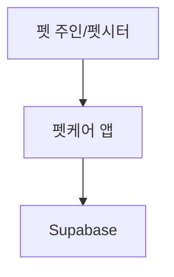
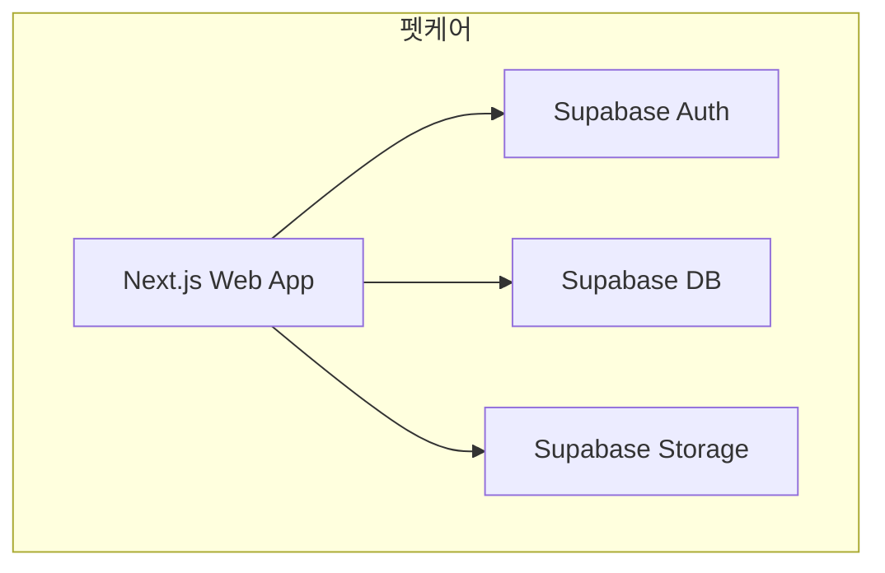

# Architecture 워크플로우 예시

펫시터 매칭 앱 "펫케어" 프로젝트의 Architecture 워크플로우 진행 예시입니다.

---

## 예시 1: 오픈소스 없이 처음부터

### Step 0: 문서 로드 (자동)

AI가 PRD, UX Design, TRD를 자동으로 로드합니다.

**Claude:**
```
펫케어의 시스템 아키텍처를 설계할게요!

**로드된 정보:**
- PRD: 펫시터 매칭 앱, 핵심 기능 5개
- UX: 화면 8개
- TRD: Next.js + Supabase + shadcn/ui

아키텍처를 설계 중이에요...
```

---

### Step 1: AI 자동 결정

**Claude:**
```
아키텍처 설계가 완료됐어요!

**패턴 결정:**
- Clean Architecture (3-Layer)
- Serverless + BFF (Supabase 사용이므로)

**PRD 기능 → Use Case 매핑:**
| 기능 | Use Case |
|-----|----------|
| 펫시터 검색 | FindPetSitters |
| 펫시터 상세 보기 | GetPetSitter |
| 예약 생성 | CreateBooking |
| 예약 취소 | CancelBooking |
| 리뷰 작성 | CreateReview |

**UX 화면 → 페이지 매핑:**
| 화면 | 경로 | Use Case |
|-----|------|----------|
| 홈 | / | FindPetSitters |
| 펫시터 상세 | /sitter/:id | GetPetSitter |
| 예약하기 | /booking | CreateBooking |
| 내 예약 | /my-bookings | GetMyBookings |

아키텍처 문서를 생성할게요!
```

---

### Step 2: 아키텍처 문서 생성

**Claude:**
```
Architecture 완료!

**저장 위치**: anyon-docs/planning/architecture.md

**요약:**
- 패턴: Clean Architecture + Serverless
- 레이어: Domain / Application / Infrastructure
- Use Cases: 5개
- Entities: User, Pet, PetSitter, Booking, Review
- C4 다이어그램 포함

**다음**: ERD 워크플로우
```

---

## 예시 2: 오픈소스 활용 (cal.com 기반)

### Step 0: 문서 로드 + 오픈소스 분석

**Claude:**
```
예약 서비스의 시스템 아키텍처를 설계할게요!

**로드된 정보:**
- PRD: 예약 서비스, cal.com 기반
- TRD: Next.js 14 + tRPC + Prisma (cal.com 스택)

**오픈소스 분석 (cal.com):**

기존 코드 → Clean Architecture 매핑:

| cal.com 경로 | 역할 | Clean Architecture |
|-------------|-----|-------------------|
| /packages/types | 타입 정의 | Domain/entities |
| /packages/lib | 비즈니스 로직 | Application/usecases |
| /packages/trpc | API 레이어 | Infrastructure/api |
| /apps/web/components | UI 컴포넌트 | Presentation/components |

**활용 방식:**
- 예약 로직: 그대로 사용 (검증됨)
- 인증: NextAuth 그대로 사용
- UI: 스타일만 수정
- 결제: Stripe → 토스페이먼츠로 교체
```

---

### Step 1: AI 자동 결정

**Claude:**
```
아키텍처 설계가 완료됐어요!

**패턴:** Modular Monolith (cal.com 따라감)

**레이어 구성:**

| 레이어 | cal.com 코드 활용 | 새로 구현 |
|-------|-----------------|----------|
| Domain | /packages/types 재사용 | 추가 Entity만 |
| Application | /packages/lib 재사용 | 커스텀 Use Case |
| Infrastructure | /packages/trpc 재사용 | 결제 어댑터 교체 |
| Presentation | 컴포넌트 재사용 | 스타일 수정 |

아키텍처 문서를 생성할게요!
```

---

### Step 2: 아키텍처 문서 생성

**Claude:**
```
Architecture 완료!

**저장 위치**: anyon-docs/planning/architecture.md

**요약:**
- 패턴: Modular Monolith (cal.com 기반)
- 오픈소스 활용: 70% 재사용, 30% 커스텀
- 레이어 매핑 가이드 포함

**다음**: ERD 워크플로우
```

---

## 생성된 아키텍처 문서 예시

```markdown
---
document_type: Architecture
project_name: 펫케어
architecture_pattern: Clean Architecture + Serverless
created_date: 2024-01-15
---

# 펫케어 - System Architecture

## 1. 아키텍처 개요

### 패턴
- **Clean Architecture** (3-Layer)
- **배포 패턴**: Serverless + BFF

### 의존성 규칙
Infrastructure → Application → Domain (안쪽으로만 의존)

---

## 2. Domain Layer

### Entities

| Entity | 속성 | 타입 | 설명 |
|--------|-----|------|------|
| User | id | string | 사용자 고유 ID |
| User | email | string | 이메일 |
| User | role | UserRole | 역할 (owner/sitter) |
| Pet | id | string | 펫 고유 ID |
| Pet | name | string | 펫 이름 |
| Pet | ownerId | string | 주인 ID (FK) |
| PetSitter | id | string | 펫시터 ID |
| PetSitter | userId | string | 사용자 ID (FK) |
| PetSitter | rating | number | 평점 |
| Booking | id | string | 예약 ID |
| Booking | petId | string | 펫 ID (FK) |
| Booking | sitterId | string | 펫시터 ID (FK) |
| Booking | status | BookingStatus | 상태 |

### Value Objects

| Value Object | 속성 | 설명 |
|-------------|-----|------|
| DateRange | start, end | 예약 기간 |
| Location | lat, lng, address | 위치 |

### Interfaces

| Interface | 메서드 | 설명 |
|-----------|-------|------|
| IUserRepository | findById, save | 사용자 저장소 |
| IPetRepository | findByOwner, save | 펫 저장소 |
| IBookingRepository | findById, save, findByUser | 예약 저장소 |

---

## 3. Application Layer (Use Cases)

### Use Case 목록

| Use Case | 입력 | 출력 | 설명 |
|----------|-----|------|------|
| FindPetSitters | { location, date } | PetSitter[] | 펫시터 검색 |
| GetPetSitter | { id } | PetSitter | 펫시터 상세 |
| CreateBooking | { petId, sitterId, dateRange } | Booking | 예약 생성 |
| CancelBooking | { bookingId } | void | 예약 취소 |
| CreateReview | { bookingId, rating, comment } | Review | 리뷰 작성 |

### Use Case 상세

#### CreateBooking
```typescript
interface CreateBookingInput {
  petId: string;
  sitterId: string;
  dateRange: DateRange;
}

// 비즈니스 규칙
1. 펫이 존재하는지 확인
2. 펫시터가 해당 기간에 가능한지 확인
3. 예약 생성
4. 펫시터에게 알림 발송

interface CreateBookingOutput {
  booking: Booking;
}
```

---

## 4. Infrastructure Layer

### API Client
- Supabase Client (자동 인증 토큰 처리)

### Repository 구현체

| Repository | 구현 | 테이블 |
|------------|-----|--------|
| UserRepositoryImpl | Supabase | users |
| PetRepositoryImpl | Supabase | pets |
| BookingRepositoryImpl | Supabase | bookings |

### External Services

| 서비스 | 용도 |
|-------|-----|
| Supabase Auth | 인증 |
| Supabase Storage | 이미지 저장 |

---

## 5. Presentation Layer

### 페이지 구조

| 페이지 | 경로 | Use Case |
|-------|-----|----------|
| Home | / | FindPetSitters |
| SitterDetail | /sitter/:id | GetPetSitter |
| Booking | /booking | CreateBooking |
| MyBookings | /my-bookings | GetMyBookings |

### 상태 관리

| 상태 종류 | 도구 |
|---------|-----|
| 서버 상태 | React Query |
| 앱 상태 | Zustand |

---

## 6. 폴더 구조

```
src/
├── domain/
│   ├── entities/
│   │   ├── User.ts
│   │   ├── Pet.ts
│   │   ├── PetSitter.ts
│   │   └── Booking.ts
│   ├── value-objects/
│   │   ├── DateRange.ts
│   │   └── Location.ts
│   └── interfaces/
│       ├── IUserRepository.ts
│       └── IBookingRepository.ts
│
├── application/
│   └── usecases/
│       ├── FindPetSitters.ts
│       ├── CreateBooking.ts
│       └── CancelBooking.ts
│
├── infrastructure/
│   ├── supabase/
│   │   └── client.ts
│   └── repositories/
│       ├── UserRepositoryImpl.ts
│       └── BookingRepositoryImpl.ts
│
└── presentation/
    ├── components/
    ├── hooks/
    └── pages/
```

---

## 7. 데이터 흐름

### 예약 생성 플로우
```
1. 사용자 → BookingPage: 예약 폼 제출
2. BookingPage → useCreateBooking: mutation 호출
3. useCreateBooking → CreateBookingUseCase: execute()
4. CreateBookingUseCase → IBookingRepository: save()
5. BookingRepositoryImpl → Supabase: INSERT
6. 성공 → 사용자: 예약 완료 화면
```

---

## 8. 시스템 구성도 (C4)

### Level 1: Context


### Level 2: Container


---

## 9. 배포 구조

| 환경 | 호스팅 | URL |
|-----|-------|-----|
| Production | Vercel | petcare.app |
| Staging | Vercel | staging.petcare.app |
| Development | Local | localhost:3000 |

---

## 10. 확장성 전략

### Phase 1: MVP (0-100 사용자)
- 단일 Vercel 인스턴스
- Supabase Free Tier
- 예상 비용: $0/월

### Phase 2: Growth (100-1,000 사용자)
- Vercel Pro
- Supabase Pro
- CDN 적용
- 예상 비용: ~$50/월

### Phase 3: Scale (1,000+ 사용자)
- Edge Functions
- 캐싱 전략
- 예상 비용: ~$200/월

---

## 11. AI 개발 가이드라인

### 새 기능 추가 시
1. Domain에 Entity/Interface 정의
2. Application에 Use Case 작성
3. Infrastructure에 Repository 구현
4. Presentation에 UI 연결

### 코드 규칙
- Domain은 외부 라이브러리 금지 (순수 TS)
- Use Case는 하나의 책임만
- Repository는 Interface 기반
```

---

## 핵심 포인트

1. **질문 없음**: 모든 결정은 PRD/UX/TRD 기반으로 자동
2. **Clean Architecture**: 3-Layer 구조로 일관성 있게 설계
3. **Use Case 매핑**: PRD 기능 → Application 레이어
4. **오픈소스 분석**: 기존 코드를 레이어에 매핑
5. **AI 개발 가이드**: 새 기능 추가 방법 포함
