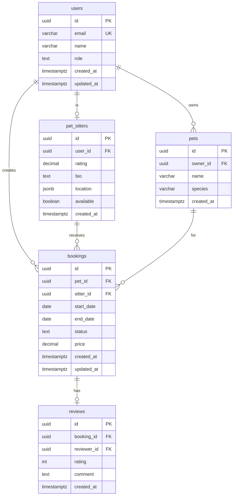

# ERD 워크플로우 예시

펫시터 매칭 앱 "펫케어" 프로젝트의 ERD 워크플로우 진행 예시입니다.

---

## Step 0: 문서 로드 (자동)

**Claude:**
```
펫케어의 ERD를 생성할게요!

Architecture에서 Entity를 추출하고 Physical Schema로 변환할게요...
```

**로드된 정보:**

| 문서 | 추출 내용 |
|-----|----------|
| Architecture | Entities 5개, Value Objects 2개, Repository Interfaces 5개 |
| TRD | database: PostgreSQL, backend: Next.js |
| PRD | 목표 사용자: 1,000명 (MVP) |

```
문서 로드 완료!

**Architecture에서 추출:**
- Entities: 5개 (User, Pet, PetSitter, Booking, Review)
- Value Objects: 2개 (DateRange, Location)
- Repository Interfaces: 5개

**TRD에서 추출:**
- Database: PostgreSQL
- ORM: Prisma (자동 추론)

Entity를 Physical Schema로 변환 중...
```

---

## Step 1: Physical Schema 자동 생성

**Claude:**
```
Physical Schema 생성 완료!

**테이블 변환 결과:**
| Entity | Table | Columns | Indexes | FKs |
|--------|-------|---------|---------|-----|
| User | users | 6 | 3 | 0 |
| Pet | pets | 5 | 2 | 1 |
| PetSitter | pet_sitters | 7 | 3 | 1 |
| Booking | bookings | 9 | 5 | 2 |
| Review | reviews | 6 | 3 | 2 |

**자동 설정:**
- 정규화: 3NF (MVP 규모)
- 총 인덱스: 16개
- FK 제약조건: 6개

ERD 문서를 생성 중...
```

---

## Step 2: ERD 문서 생성

**Claude:**
```
ERD 완료!

**저장 위치**: anyon-docs/planning/erd.md

**Physical Schema 요약:**
| 항목 | 개수 |
|-----|------|
| Tables | 5 |
| Columns | 33 |
| Foreign Keys | 6 |
| Indexes | 16 |

**포함된 내용:**
- Mermaid ERD 다이어그램
- 모든 테이블 상세 스키마 (GitHub spec-kit 스타일)
- Migration 코드 스니펫 (Prisma)
- 인덱싱 전략
- 확장성 고려사항
- AI 구현 가이드

---

# Startup Launchpad 완료!

모든 문서가 생성되었습니다:
1. PRD (prd.md)
2. UX Design (ui-ux.html)
3. UI Design Guide (design-guide.md)
4. TRD (trd.md)
5. Architecture (architecture.md)
6. ERD (erd.md)

**이제 개발을 시작할 수 있습니다!**
```

---

## 생성된 ERD 문서 예시

```markdown
---
document_type: ERD
project_name: 펫케어
created_date: 2024-01-15
source_documents:
  - architecture.md (Entities, Interfaces)
  - trd.md (Database, Tech Stack)

database:
  type: PostgreSQL
  orm: Prisma

schema:
  tables: 5
  foreign_keys: 6
  indexes: 16
---

# 펫케어 - Entity Relationship Diagram

> Architecture의 Domain Layer를 Physical Database Schema로 변환한 문서

---

## 1. ERD 다이어그램



---

## 2. 테이블 스펙

### users

> 사용자 계정 정보

**From Architecture**: `User`

| Column | Type | Nullable | Default | Description |
|--------|------|----------|---------|-------------|
| id | UUID | NOT NULL | gen_random_uuid() | PK |
| email | VARCHAR(255) | NOT NULL | - | UNIQUE, 로그인용 |
| name | VARCHAR(100) | NOT NULL | - | 표시 이름 |
| role | TEXT | NOT NULL | 'owner' | CHECK (role IN ('owner', 'sitter', 'both')) |
| created_at | TIMESTAMPTZ | NOT NULL | NOW() | 가입일 |
| updated_at | TIMESTAMPTZ | NOT NULL | NOW() | 수정일 |

**Indexes:**
- `users_pkey`: id (PRIMARY KEY)
- `users_email_key`: email (UNIQUE)
- `users_created_at_idx`: created_at DESC (정렬용)

**Constraints:**
- `PRIMARY KEY`: id
- `UNIQUE`: email
- `CHECK`: role IN ('owner', 'sitter', 'both')

---

### pets

> 펫 정보

**From Architecture**: `Pet`

| Column | Type | Nullable | Default | Description |
|--------|------|----------|---------|-------------|
| id | UUID | NOT NULL | gen_random_uuid() | PK |
| owner_id | UUID | NOT NULL | - | FK → users |
| name | VARCHAR(100) | NOT NULL | - | 펫 이름 |
| species | VARCHAR(50) | NOT NULL | - | 종류 (dog, cat, etc) |
| created_at | TIMESTAMPTZ | NOT NULL | NOW() | 등록일 |

**Indexes:**
- `pets_pkey`: id (PRIMARY KEY)
- `pets_owner_id_idx`: owner_id (FK 조회용)

**Constraints:**
- `PRIMARY KEY`: id
- `FOREIGN KEY`: owner_id → users(id) ON DELETE CASCADE

---

### bookings

> 예약 정보

**From Architecture**: `Booking`

| Column | Type | Nullable | Default | Description |
|--------|------|----------|---------|-------------|
| id | UUID | NOT NULL | gen_random_uuid() | PK |
| pet_id | UUID | NOT NULL | - | FK → pets |
| sitter_id | UUID | NOT NULL | - | FK → pet_sitters |
| start_date | DATE | NOT NULL | - | 시작일 |
| end_date | DATE | NOT NULL | - | 종료일 |
| status | TEXT | NOT NULL | 'pending' | CHECK (status IN (...)) |
| price | DECIMAL(10,2) | NOT NULL | - | 총 금액 |
| created_at | TIMESTAMPTZ | NOT NULL | NOW() | 생성일 |
| updated_at | TIMESTAMPTZ | NOT NULL | NOW() | 수정일 |

**Indexes:**
- `bookings_pkey`: id (PRIMARY KEY)
- `bookings_pet_id_idx`: pet_id (FK 조회용)
- `bookings_sitter_id_idx`: sitter_id (FK 조회용)
- `bookings_status_idx`: status (필터링용)
- `bookings_date_range_idx`: start_date, end_date (날짜 검색용)

**Constraints:**
- `PRIMARY KEY`: id
- `FOREIGN KEY`: pet_id → pets(id) ON DELETE CASCADE
- `FOREIGN KEY`: sitter_id → pet_sitters(id) ON DELETE CASCADE
- `CHECK`: status IN ('pending', 'confirmed', 'completed', 'cancelled')
- `CHECK`: end_date >= start_date

---

## 3. 관계 (Relationships)

| From | To | Type | FK Column | On Delete |
|------|-----|------|-----------|-----------|
| pets | users | N:1 | owner_id | CASCADE |
| pet_sitters | users | 1:1 | user_id | CASCADE |
| bookings | pets | N:1 | pet_id | CASCADE |
| bookings | pet_sitters | N:1 | sitter_id | CASCADE |
| reviews | bookings | 1:1 | booking_id | CASCADE |
| reviews | users | N:1 | reviewer_id | SET NULL |

---

## 4. Migration 코드

### Prisma Schema

```prisma
model User {
  id        String   @id @default(uuid())
  email     String   @unique
  name      String
  role      String   @default("owner")
  createdAt DateTime @default(now()) @map("created_at")
  updatedAt DateTime @updatedAt @map("updated_at")

  pets      Pet[]
  sitter    PetSitter?
  bookings  Booking[]
  reviews   Review[]

  @@map("users")
}

model Pet {
  id        String   @id @default(uuid())
  ownerId   String   @map("owner_id")
  name      String
  species   String
  createdAt DateTime @default(now()) @map("created_at")

  owner     User     @relation(fields: [ownerId], references: [id], onDelete: Cascade)
  bookings  Booking[]

  @@index([ownerId])
  @@map("pets")
}

model Booking {
  id        String   @id @default(uuid())
  petId     String   @map("pet_id")
  sitterId  String   @map("sitter_id")
  startDate DateTime @map("start_date") @db.Date
  endDate   DateTime @map("end_date") @db.Date
  status    String   @default("pending")
  price     Decimal  @db.Decimal(10, 2)
  createdAt DateTime @default(now()) @map("created_at")
  updatedAt DateTime @updatedAt @map("updated_at")

  pet       Pet       @relation(fields: [petId], references: [id], onDelete: Cascade)
  sitter    PetSitter @relation(fields: [sitterId], references: [id], onDelete: Cascade)
  review    Review?

  @@index([petId])
  @@index([sitterId])
  @@index([status])
  @@index([startDate, endDate])
  @@map("bookings")
}
```

---

## 5. 인덱싱 전략

### Use Case 기반 인덱스

| Use Case | Table | Index | Purpose |
|----------|-------|-------|---------|
| FindPetSitters | pet_sitters | location, available | 위치+가능여부 검색 |
| GetMyBookings | bookings | pet_id, status | 내 펫 예약 조회 |
| GetSitterBookings | bookings | sitter_id, status | 펫시터 예약 조회 |

### 성능 인덱스

| Table | Index | Type | Columns |
|-------|-------|------|---------|
| users | users_created_at_idx | BTREE | created_at DESC |
| bookings | bookings_date_range_idx | BTREE | start_date, end_date |

---

## 6. 확장성 고려사항

### Phase 1: MVP (0-1,000 사용자)
- 단일 DB 인스턴스
- 기본 인덱싱
- 예상 비용: $0 (Supabase Free)

### Phase 2: Growth (1,000-10,000 사용자)
- Read Replica 추가
- Redis 캐싱 (펫시터 목록)
- 비정규화 후보: pet_sitters.rating_count

### Phase 3: Scale (10,000+ 사용자)
- Horizontal Partitioning (bookings by date)
- Database Clustering

---

## 7. AI 구현 가이드

### 테이블 생성 순서 (FK 의존성)
1. users (의존성 없음)
2. pets (users 필요)
3. pet_sitters (users 필요)
4. bookings (pets, pet_sitters 필요)
5. reviews (bookings, users 필요)

### 시드 데이터

```sql
-- Users
INSERT INTO users (id, email, name, role) VALUES
  ('u1', 'owner@example.com', '김펫주인', 'owner'),
  ('u2', 'sitter@example.com', '박펫시터', 'sitter');

-- Pets
INSERT INTO pets (id, owner_id, name, species) VALUES
  ('p1', 'u1', '뽀삐', 'dog');

-- Pet Sitters
INSERT INTO pet_sitters (id, user_id, rating, bio, available) VALUES
  ('s1', 'u2', 4.8, '5년 경력의 펫시터입니다', true);

-- Bookings
INSERT INTO bookings (id, pet_id, sitter_id, start_date, end_date, status, price) VALUES
  ('b1', 'p1', 's1', '2024-01-20', '2024-01-22', 'confirmed', 50000);
```
```

---

## 핵심 포인트

1. **질문 없음**: Architecture/TRD에서 모든 정보 자동 추출
2. **자동 변환**: Entity → Table, 타입 매핑, 인덱스/제약조건
3. **GitHub spec-kit 스타일**: 간결하면서도 구현 가능한 수준
4. **Migration 코드 포함**: AI가 바로 실행 가능
5. **테이블 생성 순서**: FK 의존성 고려
